# Cookie

## 快速体验

* ```java
    @WebServlet(name = "Test1", urlPatterns = "/Test1")
    public class Test1 extends HttpServlet {
        protected void doPost(HttpServletRequest request, HttpServletResponse response) throws ServletException, IOException {
            Cookie cookie = new Cookie("cookie", "testCookie");
            response.addCookie(cookie);
            response.addCookie(new Cookie("hello", "你好"));
        }
        protected void doGet(HttpServletRequest request, HttpServletResponse response) throws ServletException, IOException {
            this.doPost(request, response);
        }
    }//设置了两个Cookie
    ```

    ```java
    @WebServlet(name = "Test2", urlPatterns = "/Test2")
    public class Test2 extends HttpServlet {
        protected void doPost(HttpServletRequest request, HttpServletResponse response) throws ServletException, IOException {
            System.out.println("*******************************************************************");
            Cookie[] cookies = request.getCookies();
            for (Cookie each : cookies) {
                System.out.println(each.getName() + "=" + each.getValue());
            }
        }
        protected void doGet(HttpServletRequest request, HttpServletResponse response) throws ServletException, IOException {
            this.doPost(request, response);
        }
    }//在另外一个页面中提取Cookie的键值对并输出
    ```

* 先访问`localhost:8080/TestCookie/Test1`再访问`localhost:8080/TestCookie/Test2`

* 结果为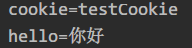

## 持久化

* 默认情况下，关闭浏览器Cookie即会被删除

	* 还是上面两个`Servlet`
	* 先访问`localhost:8080/TestCookie/Test1`，再关闭浏览器，再访问`localhost:8080/TestCookie/Test2`
	* 控制台中没有上面的Cookie
	
* 修改Test1.java

    ```java
    @WebServlet(name = "Test1", urlPatterns = "/Test1")
    public class Test1 extends HttpServlet {
        protected void doPost(HttpServletRequest request, HttpServletResponse response) throws ServletException, IOException {
            System.out.println("Hello");
            Cookie cookie = new Cookie("cookie", "testCookie");
            cookie.setMaxAge(20);//设置持续时间
            response.addCookie(cookie);
            response.addCookie(new Cookie("hello", "你好"));
        }
        protected void doGet(HttpServletRequest request, HttpServletResponse response) throws ServletException, IOException {
            this.doPost(request, response);
        }
    }
    ```

* 还是刚才的操作，先访问`localhost:8080/TestCookie/Test1`，再访问`localhost:8080/TestCookie/Test2`，控制台输出为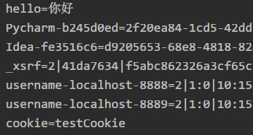

* 等待20秒后刷新`localhost:8080/TestCookie/Test2`，输出为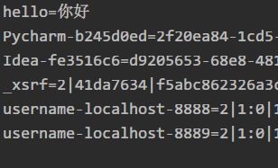

* 可以发现，`cookie=testCookie`消失，原因是我们设置了20秒后自动删除，而没有设置自动删除的`cookie`被保留下来，当然如果关闭了浏览器，它也会被删除

* 如果设置`cookie.setMaxAge()`参数为一个很大的值，那么它将会被长时间保留，即使关闭了浏览器也是如此，将其设置为`10000`

* 访问Test1后关闭浏览器再访问Test2，输出为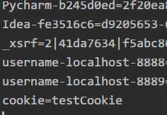

* 说明这个`Cookie`被持续存储了

## 共享

* 实现两个项目共享一个`Cookie`，为此在IDEA中新建一个`Module`

* ```java
    @WebServlet(name = "Test1", urlPatterns = "/Test1")
    public class Test1 extends HttpServlet {
        protected void doPost(HttpServletRequest request, HttpServletResponse response) throws ServletException, IOException {
            System.out.println("Hello");
            Cookie cookie = new Cookie("cookie", "testCookie");
            cookie.setPath("/");//设置cookie路径为根目录，若不设置则在新项目中就get不到cookie
            response.addCookie(cookie);
            response.addCookie(new Cookie("hello", "你好"));
        }
        protected void doGet(HttpServletRequest request, HttpServletResponse response) throws ServletException, IOException {
            this.doPost(request, response);
        }
    }
    ```

    ```java
    @WebServlet(name = "Test2", urlPatterns = "/Test2")
    public class Test2 extends HttpServlet {
        protected void doPost(HttpServletRequest request, HttpServletResponse response) throws ServletException, IOException {
            System.out.println("*******************************************************************");
            Cookie[] cookies = request.getCookies();
            for (Cookie each : cookies) {
                System.out.println(each.getName() + "=" + each.getValue());
            }
        }
        protected void doGet(HttpServletRequest request, HttpServletResponse response) throws ServletException, IOException {
            this.doPost(request, response);
        }
    }
    ```

    ```java
    @WebServlet(name = "TestCookie", urlPatterns = "/TestCookie")
    public class TestCookie extends HttpServlet {
        protected void doPost(HttpServletRequest request, HttpServletResponse response) throws ServletException, IOException {
            System.out.println("TestCookie");
            Cookie[] cookies = request.getCookies();
            for (Cookie each : cookies) {
                System.out.println(each.getName() + "=" + each.getValue());
            }
        }
        protected void doGet(HttpServletRequest request, HttpServletResponse response) throws ServletException, IOException {
            this.doPost(request, response);
        }
    }//新项目下获取cookie
    ```

* 先访问`Test1`，再访问`Test2`，再访问`TestCookie`

* 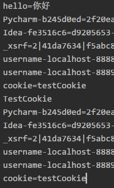

* 成功地实现了在不同项目中共享`Cookie`

## 案例

首次访问页面时显示`欢迎首次`，第二次则显示`欢迎回来`，使用cookies作为标记来确定是否为第一次访问

* ```java
    @WebServlet(name = "LastTime", urlPatterns = "/LastTime")//http://localhost:8080/TestCookie/LastTime
    public class LastTime extends HttpServlet {
        protected void doPost(HttpServletRequest request, HttpServletResponse response) throws ServletException, IOException {
            response.setContentType("text/html;charset=utf-8");
            Cookie[] cookies = request.getCookies();
            boolean flag = false;
            if (cookies != null && cookies.length > 0){//若存在cookie且长度大于0时，应该显示再次访问页面
                for (Cookie each : cookies){
                    String name = each.getName();
                    if("lasttime".equals(name)){
                        flag = true;//设置标志位
                        Date date = new Date();
                        SimpleDateFormat simpleDateFormat = new SimpleDateFormat("yyyy-mm-dd hh:mm:ss");
                        String sdate = simpleDateFormat.format(date);//格式化时间日期
                        sdate = URLEncoder.encode(sdate, "utf-8");//使用utf转码传输，否则会报错
                        each.setValue(sdate);//设置键值
                        each.setMaxAge(10);//10秒便于测试
                        response.addCookie(each);//加入cookie
                        String value = each.getValue();
                        value = URLDecoder.decode(value, "utf-8");//解码输出时间
                        response.getWriter().write("<h1>欢迎回来,上次的访问时间是</h1>" + value);
                    }
                }
            }
            if (cookies == null || cookies.length == 0 || !flag){//若不存在cookie或者flag标志位显示未访问过时，这个时候应该显示首次访问页面
                Date date = new Date();
                SimpleDateFormat simpleDateFormat = new SimpleDateFormat("yyyy mm dd hh:mm:ss");
                String sdate = simpleDateFormat.format(date);
                sdate = URLEncoder.encode(sdate, "utf-8");
                Cookie lasttime = new Cookie("lasttime", sdate);
                lasttime.setMaxAge(10);//10秒便于测试
                response.addCookie(lasttime);
                response.getWriter().write("<h1>欢迎首次访问</h1>");
            }
        }
        protected void doGet(HttpServletRequest request, HttpServletResponse response) throws ServletException, IOException {
            this.doPost(request, response);
        }
    }
    ```

* 第一次进入`localhost:8080/TestCookie/LastTime`时，显示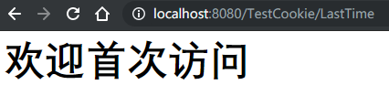

* 刷新一下则显示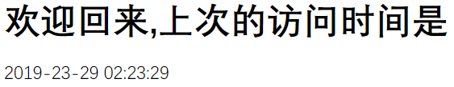

## Session

*一次开关浏览器即是一个Session*

* ```java
    @WebServlet(name = "TestSession", urlPatterns = "/TestSession")//http://localhost:8080/TestCookie/TestSession
    public class TestSession extends HttpServlet {
        protected void doPost(HttpServletRequest request, HttpServletResponse response) throws ServletException, IOException {
            HttpSession session = request.getSession();
            session.setAttribute("session", "test");
            System.out.println("/TestSession:session=test");
        }
        protected void doGet(HttpServletRequest request, HttpServletResponse response) throws ServletException, IOException {
            this.doPost(request, response);
        }
    }
    ```

    ```java
    @WebServlet(name = "TestSession2", urlPatterns = "/TestSession2")//http://localhost:8080/TestCookie/TestSession2
    public class TestSession2 extends HttpServlet {
        protected void doPost(HttpServletRequest request, HttpServletResponse response) throws ServletException, IOException {
            HttpSession session = request.getSession();
            System.out.print("/TestSession2:session=");
            System.out.println(session.getAttribute("session"));
        }
        protected void doGet(HttpServletRequest request, HttpServletResponse response) throws ServletException, IOException {
            this.doPost(request, response);
        }
    }
    ```

* 先访问`localhost:8080/TestCookie/TestSession`再访问`localhost:8080/TestCookie/TestSession2`，结果为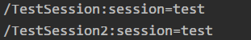

* 重启浏览器再访问`localhost:8080/TestCookie/TestSession2`，结果为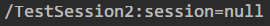

* 观察两次访问网页的`RequestHeaders`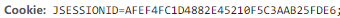和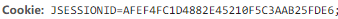发现是一样的

* `Session`实现依赖于`Cookie`，设置`Session`参数时也新生成了`Cookie`的`id`，而`Session`设置的参数被存储在服务器中，一旦会话结束，随着`Cookie`的删除，`Session`也被删除了

* 客户端关闭，服务器不关闭，则两次获取的Session默认不是一个Session，但是可以实现让他们相同

* 客户端不关闭，服务器关闭，两次获取的`Session`一般不是一个`Session`，先访问`localhost:8080/TestCookie/TestSession3`，控制台输出`org.apache.catalina.session.StandardSessionFacade@7395d3cf`，重启服务器后再访问输出`org.apache.catalina.session.StandardSessionFacade@5891c82b`，即使没有关闭浏览器，两次`Session`的`id`还是不一样


