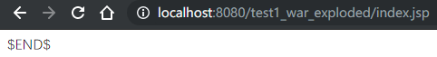

# Filter

## 快速体验

* ```java
  /*
  过滤指定页面的请求
  */
  @WebFilter(filterName = "TestFilter", urlPatterns = "/*")//设定要处理的页面面
  public class TestFilter implements Filter {
    public void destroy() {
    }
    public void doFilter(ServletRequest req, ServletResponse resp, FilterChain chain) throws ServletException, IOException {
        System.out.println(this.toString());
        chain.doFilter(req, resp);//放行
    }
    public void init(FilterConfig config) throws ServletException {
    }
  }
  /*控制台输出
  TestFilter@42cd4950
  */
  ```

* 结果

## 细节

*   ```java
    public void doFilter(ServletRequest req, ServletResponse resp, FilterChain chain) throws ServletException, IOException {
            System.out.println("doFilter...");
            chain.doFilter(req, resp);
            System.out.println("doFilter again...");
        }
    /*
    结果为doFilter...
    FilterDemo1.jsp
    doFilter again...
    过滤之后还会返回*/
    ```

    ```jsp
    <body>
    <%
      System.out.println("FilterDemo1.jsp");
    %>
    </body>
    ```

*   ```java
    @WebFilter(filterName = "FilterDemo2", urlPatterns = "/FilterDemo2.jsp")
    public class FilterDemo2 implements Filter {
        public void destroy() {
            System.out.println("destroy...");//服务器关闭后执行
        }
    
        public void doFilter(ServletRequest req, ServletResponse resp, FilterChain chain) throws ServletException, IOException {
            System.out.println("doFilter...");//进行过滤时执行
            chain.doFilter(req, resp);
        }
        public void init(FilterConfig config) throws ServletException {
            System.out.println("init...");//初始化时执行
        }
    }
    ```

    连续访问两次``localhost:8080/test1_war_exploded/FilterDemo2.jsp`，结果为

* ```java
@WebFilter(filterName = "FilterDemo3", urlPatterns = "/index.jsp", dispatcherTypes = DispatcherType.REQUEST)
  public class FilterDemo3 implements Filter {
      public void destroy() {
      }
      public void doFilter(ServletRequest req, ServletResponse resp, FilterChain chain) throws ServletException, IOException {
          System.out.println("DispatcherType.REQUEST");
          chain.doFilter(req, resp);
      }
      public void init(FilterConfig config) throws ServletException {
      }
  }
  ```
  
  ```java
  @WebFilter(filterName = "FilterDemo4", urlPatterns = "/index.jsp", dispatcherTypes = DispatcherType.FORWARD)
  public class FilterDemo4 implements Filter {
      public void destroy() {
      }
      public void doFilter(ServletRequest req, ServletResponse resp, FilterChain chain) throws ServletException, IOException {
          System.out.println("DispatcherType.FORWARD");
          chain.doFilter(req, resp);
      }
      public void init(FilterConfig config) throws ServletException {
      }
  }
  ```
  
  二者都标记为访问`index.jsp`时执行过滤，但是第一个标注为直接访问，第二个为转发访问，所以直接访问`index.jsp`时，输出`DispatcherType.REQUEST`，而转发访问时输出`DispatcherType.FORWARD`


