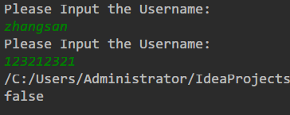
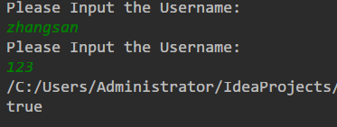
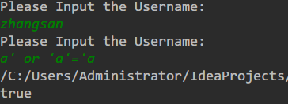
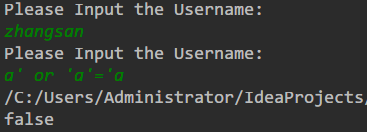
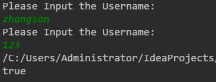

# JDBC

>   在Java中执行数据库语句
---

## 快速实现

* 下载并导入Connector，此时注意要和安装的mysql版本对应，之前不对应的话就会报错 

* 在`./`下新建一个`libs`文件夹，用来放置connector的包，在`libs`上右键选择`Add as library`

* `./src`下新建测试类`Demo1.java`

* ```java
    public class Demo1 {
        public static void main(String[] args) throws ClassNotFoundException, SQLException {
            Class.forName("com.mysql.cj.jdbc.Driver");
            Connection conn = DriverManager.getConnection("jdbc:mysql://localhost:3306/test?useSSL=false&serverTimezone=UTC", "root", "");
            //参考网络上的8.0连接方法
            //需要设置useSSL和serverTimezone参数
            String sql = "select * from dept";
            //test数据库是有数据的，故本次查询返回的就是查询成功与否
            Statement stmt = conn.createStatement();
            boolean count = stmt.execute(sql);
            System.out.println(count);
            stmt.close();
            conn.close();
        }
    }
    ```

* 控制台输出

---
## DriverManager

* ```java
  //注册驱动
  static {
        try {
            DriverManager.registerDriver(new Driver());
        } catch (SQLException var1) {
            throw new RuntimeException("Can't register driver!");
        }
    }
  //观察`mysql-connector-java-8.0.11\com\mysql\cj\jdbc\Driver.java`的源码就会发现，每次`DriverManager`强制运行`registerDriver`方法
  ```

* ```java
	// 获取mysql连接
	//如果要连接本机的3306时，可以省略不写
  Connection conn = DriverManager.getConnection("jdbc:mysql:///test?useSSL=false&serverTimezone=UTC", "root", "");
  //Connection conn = DriverManager.getConnection("jdbc:mysql://localhost:3306/test?useSSL=false&serverTimezone=UTC", "root", "");
  //以上两个的执行效果一样
  ```
## ResultSet

*   使用ResultSet输出数据库中的结果

*   ```java
    public static void main(String[] args) throws ClassNotFoundException, SQLException {
            Connection conn = DriverManager.getConnection("jdbc:mysql:///test?useSSL=false&serverTimezone=UTC", "root", "");
            String sql = "select * from dept";
            Statement stmt = conn.createStatement();
            ResultSet rs = stmt.executeQuery(sql);
            rs.next();//游标初始是在列标题的那一行，所以要向下移动一行
            System.out.println(rs.getString("loc"));//找列名字为 loc 的列
        	//输出 "北京"
            stmt.close();
            conn.close();
    }
    ```
    
*   要查询的表是这样的

*   | id   | dname  | loc  |
    | ---- | ------ | ---- |
    | 10   | 教研部 | 北京 |
    | 20   | 学工部 | 上海 |
    | 30   | 销售部 | 广州 |
    | 40   | 财务部 | 深圳 |
    
* 如果要输出所有结果则使用下面代码
  
  ```java
  public static void main(String[] args) throws ClassNotFoundException, SQLException {
          Connection conn = DriverManager.getConnection("jdbc:mysql:///test?useSSL=false&serverTimezone=UTC", "root", "");
          String sql = "select * from dept";
          Statement stmt = conn.createStatement();
          ResultSet rs = stmt.executeQuery(sql);
          while(rs.next()){
              System.out.print("id=" + rs.getInt("id") + "\t");
              System.out.print("dname=" + rs.getString("dname") + "\t");
              System.out.print("loc=" + rs.getString("loc") + "\t\n");
          }
          stmt.close();
          conn.close();
      }
  /*	结果为
  id=10	dname=教研部	loc=北京	
  id=20	dname=学工部	loc=上海	
  id=30	dname=销售部	loc=广州	
  id=40	dname=财务部	loc=深圳	*/
  ```
## 练习:导入表至类

*   将职工表转为职工对象

*   建立三个类在同一包下

*   ```java
    //.com.Login.Employee.java
    package com.Login;
    
    import java.util.Date;
    
    public class Employee {
        private int id;
        private String ename;
        private int job_id;
        private int mgr;
        private Date joindate;
        private int salary;
    
        public int getId() {
            return id;
        }
    
        public void setId(int id) {
            this.id = id;
        }
    
        public String getEname() {
            return ename;
        }
    
        public void setEname(String ename) {
            this.ename = ename;
        }
    
        public int getJob_id() {
            return job_id;
        }
    
        public void setJob_id(int job_id) {
            this.job_id = job_id;
        }
    
        public int getMgr() {
            return mgr;
        }
    
        public void setMgr(int mgr) {
            this.mgr = mgr;
        }
    
        public Date getJoindate() {
            return joindate;
        }
    
        public void setJoindate(Date joindate) {
            this.joindate = joindate;
        }
    
        public int getSalary() {
            return salary;
        }
    
        public void setSalary(int salary) {
            this.salary = salary;
        }
    
        @Override
        public String toString() {
            return "Employee{" +
                    "id=" + id +
                    ", ename='" + ename + '\'' +
                    ", job_id=" + job_id +
                    ", mgr=" + mgr +
                    ", joindate=" + joindate +
                    ", salary=" + salary +
                    '}';
        }
    }
    ```

    ```java
    //.com.Login.GetEmployee.java
    package com.Login;
    
    import java.sql.*;
    import java.util.ArrayList;
    import java.util.Date;
    import java.util.List;
    
    public class GetEmployee {
    
    
        public List<Employee> getAll() throws ClassNotFoundException, SQLException {
            Class.forName("com.mysql.cj.jdbc.Driver");
            Connection conn = DriverManager.getConnection("jdbc:mysql:///test?useSSL=false&serverTimezone=UTC", "root", "");
            Statement stmt = conn.createStatement();
            String sql = "select * from emp";
            ResultSet rs = stmt.executeQuery(sql);
            List<Employee> list = new ArrayList<Employee>();
            Employee e = null;
            while (rs.next()){
                int id = rs.getInt("id");
                String ename = rs.getString("ename");
                int job_id = rs.getInt("job_id");
                int mgr = rs.getInt("mgr");
                Date joindate = rs.getDate("joindate");
                int salary = rs.getInt("salary");
                e = new Employee();
                e.setId(id);
                e.setEname(ename);
                e.setJob_id(job_id);
                e.setMgr(mgr);
                e.setJoindate(joindate);
                e.setSalary(salary);
                list.add(e);
            }
            for (Employee each : list) {
                System.out.println(each);
            }
            stmt.close();
            conn.close();
            return list;
        }
    }
    ```

    ```java
    //.com.Login.Main.java
    package com.Login;
    
    import java.sql.SQLException;
    
    public class Main {
        public static void main(String[] args) throws SQLException, ClassNotFoundException {
            new GetEmployee().getAll();
        }
    }
    ```

*   `test`数据库的`emp`表

*   程序输出

*   在写程序时，遇到了一个问题，下面是出问题的代码和结果

*   ```java
    		Employee e = new Employee();
    		while (rs.next()){
                int id = rs.getInt("id");
                String ename = rs.getString("ename");
                int job_id = rs.getInt("job_id");
                int mgr = rs.getInt("mgr");
                Date joindate = rs.getDate("joindate");
                int salary = rs.getInt("salary");
                e.setId(id);
                e.setEname(ename);
                e.setJob_id(job_id);
                e.setMgr(mgr);
                e.setJoindate(joindate);
                e.setSalary(salary);
                list.add(e);
            }
            for (Employee each : list) {
                System.out.println(each);
            }//看起来好像没什么问题，但是为什么列表里面全是一个内容呢
    ```

    

*   经过研究后发现，每一步的while循环中，上面的代码都引用了同一个对象。比如说进行到第二步时，引用`e`的参数都被设置了，看似好像执行`add`方法毫无问题，但是`e`此时还引用着`ArrayList`里面的第一个`Employee`对象，所以此时设置引用`e`的参数，相当于也设置了`ArrayList`里面的第一个对象。这个理解也可以将上面出错的结果解释清楚，当进行最后一步时，设置`e`的属性同时也将`ArrayList`中所有元素的属性以同样的值设定了

### 使用自定的类简化连接操作

*   新建一个`utils`文件夹，包括`Utils.java`和`jdbc.properties`两个文件

*   ```java
    package com.Login.utils;
    
    import java.io.FileReader;
    import java.io.IOException;
    import java.sql.*;
    import java.util.Properties;
    
    public class Utils {
        private static String url = null;
        private static String user = null;
        private static String password = null;
        private static String driver = null;
        static {
            try {
                Properties properties = new Properties();
                String path = Utils.class.getResource("./jdbc.properties").getPath();//使用classloader获取配置文件路径，通过配置文件来设置各种连接参数
                System.out.println(path);
                properties.load(new FileReader(path));//读取配置文件来设置连接
                url = properties.getProperty("url");
                user = properties.getProperty("user");
                password = properties.getProperty("password");
                driver = properties.getProperty("driver");
                Class.forName(driver);//注册连接
            } catch (IOException e) {
                e.printStackTrace();
            } catch (ClassNotFoundException e) {
                e.printStackTrace();
            }
        }
        public static Connection getConnection() throws SQLException {
            return DriverManager.getConnection(url, user, password);
        }
        public static void close(ResultSet st, Statement stmt, Connection conn) throws SQLException {
            st.close();
            stmt.close();
            conn.close();
        }
    }//有了这个类就可以避免在读数据库时再去写繁琐的连接操作代码了
    /*
    jdbc.properties文件内容如下
    url=jdbc:mysql:///test?useSSL=false&serverTimezone=UTC
    user=root
    password=
    driver=com.mysql.cj.jdbc.Driver
    */
    ```

*   与此同时，`GetEmployee.java`文件也进行改动

*   ```java
    //        Class.forName("com.mysql.cj.jdbc.Driver");
    //        Connection conn = DriverManager.getConnection("jdbc:mysql:///test?useSSL=false&serverTimezone=UTC", "root", "");
    //旧的代码，如果要设置其他参数必须修改代码
    //**********************************************************************************************
    Connection conn = Utils.getConnection();
    Utils.close(rs, stmt, conn);//新代码只需修改配置文件即可，提升了复用性
    ```

*   运行结果与之前的没有任何区别

## 练习:用户登录

*   新建一个`user`表，存储用户信息

    | id   | name     | password |
    | ---- | -------- | -------- |
    | 1    | zhangsan | 123      |
    | 2    | lisi     | 234      |
    | 3    | wangwu   | 345      |

*   ```java
    public class Main {
        public static void main(String[] args) throws SQLException, ClassNotFoundException {
            Scanner scan_username = new Scanner(System.in);
            System.out.println("Please Input the Username:");
            String username = scan_username.nextLine();
            Scanner scan_password = new Scanner(System.in);
            System.out.println("Please Input the Username:");
            String password = scan_password.nextLine();
            System.out.println(new Main().login(username, password));//返回登陆成功与否
        }
        public boolean login(String username, String password) throws SQLException {
            if(username == null || password == null){
                return false;
            }//先判断再决定要不要建立连接
            Connection conn = Utils.getConnection();//使用了自定义的连接类，非常方便
            Statement stmt = conn.createStatement();
            String sql = "select * from user where name=\'" + username + "\'and password=\'" + password + "\'";//查询到了就返回为true
            ResultSet rs = stmt.executeQuery(sql);
            boolean result = rs.next();
            Utils.close(rs, stmt, conn);//自定义连接类
            return result;
        }
    }
    ```

* 运行结果
    

   ### 防止sql注入

* 刚才的程序有安全的隐患，比如下面的结果也可以登录成功

* 

* 所以使用`PreparedStatement`类来解决这种问题

* 代码修改如下

    ```java
    public boolean login(String username, String password) throws SQLException {
            if(username == null || password == null){
                return false;
            }
            Connection conn = Utils.getConnection();
            String sql = "select * from user where name=? and password=?";//问号也就是占位符，值会在下面设置
            PreparedStatement pstmt = conn.prepareStatement(sql);
            pstmt.setString(1, username);
            pstmt.setString(2, password);//这两行设置占位符的具体值，1和2表示位置
            ResultSet rs = pstmt.executeQuery();//这个executeQuery方法不要接收原来的sql，否则报错
            boolean result = rs.next();
            Utils.close(rs, pstmt, conn);
            return result;
        }
    ```

*   结果显示确实解决了这个问题

*   

## 事务

*   新建一个`TestTransaction`类用来测试一下事务，使用的表如下

    | id   | name  | balance |
    | ---- | ----- | ------- |
    | 1    | zhang | 1000    |
    | 2    | li    | 1000    |

*   先来看看没有事务会发生什么

    ```java
    public static void main(String[] args) throws SQLException {
            Connection conn = Utils.getConnection();
            conn.setAutoCommit(false);
            String sql1 = "update account set balance=balance-? where id=?";
            String sql2 = "update account set balance=balance+? where id=?";
            PreparedStatement pstmt1 = conn.prepareStatement(sql1);
            PreparedStatement pstmt2 = conn.prepareStatement(sql2);
            pstmt1.setInt(1, 500);
            pstmt1.setInt(2, 1);
            pstmt2.setInt(1, 500);
            pstmt2.setInt(2, 2);
            pstmt1.executeUpdate();
            int i = 1 / 0;//人为地制造了一个Exception，导致接下来的语句不能正常执行
            pstmt2.executeUpdate();
            conn.commit();
            pstmt1.close();
            pstmt2.close();
            conn.close();
        }
    ```

*   执行完后，表的内容是


