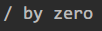

# JSP

`Java Server Pages`在网页中嵌入`Java`代码

## 快速体验

* 新建`index.jsp`

    ```jsp
    <%@ page contentType="text/html;charset=UTF-8" language="java" %>
    <html>
      <head>
        <title>$Title$</title>
      </head>
      <body>
      $END$
      <%
        System.out.println("Hello");
      %>
      <h1>Hello</h1>
      </body>
    </html>
    ```

* 部署服务器后访问`localhost:8080/TestCookie/`

* 与此同时控制台输出

## 错误页

* 有时访问网页错误时并不想看到报错信息，这时候需要定义`errorPage`属性

* ```jsp
    <%@ page contentType="text/html;charset=UTF-8" language="java" errorPage="ErrorPage.jsp" <%--设置错误页跳转至相应的页面--%>%>
    <html>
      <head>
        <title>$Title$</title>
      </head>
      <body>
      $END$
      <%
        System.out.println("Hello");
        int i = 1 / 0;<%--错误的代码块--%>
      %>
      <h1>Hello</h1>
      </body>
    </html>
    ```

* 同时编写一个`ErrorPage.jsp`文件

    ```jsp
    <%@ page contentType="text/html;charset=UTF-8" isErrorPage="true" language="java" %><%--isErrorPage标记是否为错误页，true时exception对象就可用了--%>
    <html>
    <head>
        <title>错误页面</title>
    </head>
    <body>
        <h1>服务器发生错误</h1>
        <%
            System.out.println(exception.getMessage());//这句话必须在isErrorPage为true时才可用
        %>
    </body>
    </html>
    ```

* 启动服务器访问`localhost:8080/TestCookie/`

* 控制台输出

## EL表达式

用于在jsp页面中内嵌代码

* ```jsp
    <%@ page contentType="text/html;charset=UTF-8" language="java" %>
    <html>
        <head>
            <title>TestEL</title>
        </head>
        <body>
            ${1 == 1}
            \${1 == 1}
        </body>
    </html>
    ```

    


