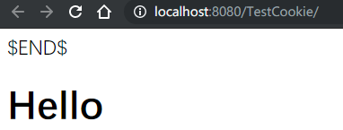
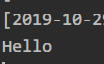

# JSP

`Java Server Pages`在网页中嵌入`Java`代码

## 快速体验

* 新建`index.jsp`

    ```html
    <%@ page contentType="text/html;charset=UTF-8" language="java" %>
    <html>
      <head>
        <title>$Title$</title>
      </head>
      <body>
      $END$
      <%
        System.out.println("Hello");
      %>
      <h1>Hello</h1>
      </body>
    </html>
    ```

* 部署服务器后访问 http://localhost:8080/TestCookie/ 

* 与此同时控制台输出

错误页

* 有时


