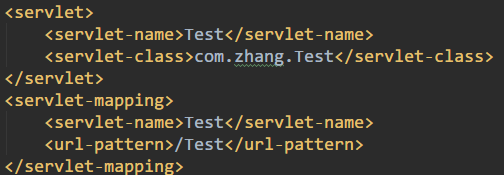
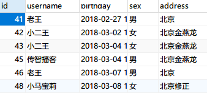
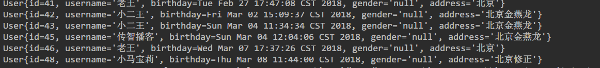

# Maven

方便地管理各种包

*   安装`Maven`只要解压到文件夹即可,同时换源确保速度

*   在`IDEA`中创建`Maven`工程,选择相应的配置文件和仓库

*   找到`pom.xml`文件,在里面编辑要用的包,后台就会自动下载,导入好需要的包

    ```xml
    <dependencies>
        <dependency>
          <groupId>junit</groupId>
          <artifactId>junit</artifactId>
          <version>4.11</version>
          <scope>test</scope>
        </dependency>
        <dependency>
          <groupId>javax.servlet</groupId>
          <artifactId>servlet-api</artifactId>
          <version>2.5</version>
        </dependency>
        <dependency>
          <groupId>org.mybatis</groupId>
          <artifactId>mybatis</artifactId>
          <version>3.4.5</version>
        </dependency>
        <dependency>
          <groupId>mysql</groupId>
          <artifactId>mysql-connector-java</artifactId>
          <version>5.1.32</version>
        </dependency>
        <dependency>
          <groupId>log4j</groupId>
          <artifactId>log4j</artifactId>
          <version>1.2.17</version>
        </dependency>
        <dependency>
          <groupId>junit</groupId>
          <artifactId>junit</artifactId>
          <version>4.12</version>
        </dependency>
      </dependencies>
    ```

*   要测试`Servlet`工程,还需配置`Tomcat`安装的路径

*   需要注意的是,这次的`URL`不能用注解配置了,需要用传统的`web.xml`文件配置

*   ```java
    public class Test extends HttpServlet {//Servlet文件内容
        @Override
        protected void service(HttpServletRequest req, HttpServletResponse resp) throws ServletException, IOException {
            req.setCharacterEncoding("utf-8");
            System.out.println("req.setCharacterEncoding(\"utf-8\")");
        }
    }
    ```

*   开启服务器,访问``localhost:8080/maven_webapp_Web_exploded/Test`,控制台输出`req.setCharacterEncoding("utf-8")`

*   测试mysql交互功能,需要先建好表

*   在`./src/main/resource/`下新建一个`SqlMapConfig.xml`文件

    ```xml
    <?xml version="1.0" encoding="UTF-8"?>
    <!DOCTYPE configuration
            PUBLIC "-//mybatis.org//DTD Config 3.0//EN"
            "http://mybatis.org/dtd/mybatis-3-config.dtd">
    <configuration>
        <environments default="mysql">
            <environment id="mysql"><!--设定mysql的各项参数-->
                <transactionManager type="jdbc"></transactionManager>
                <dataSource type="POOLED"><!---->
                    <property name="driver" value="com.mysql.jdbc.Driver"/>
                    <property name="url" value="jdbc:mysql://localhost:3306/test"/>
                    <property name="username" value="root"/>
                    <property name="password" value=""/>
                </dataSource>
            </environment>
        </environments>
        <mappers>
            <mapper class="com.zhang.dao.UserDao"></mapper><!--指定要映射的接口-->
        </mappers>
    </configuration>
    ```

*   同时在`./src/main/java/dao/`下新建`UserDao`接口

    ```java
    public interface UserDao {
        @Select("select * from user")
        List<User> findAll();
    }
    ```

*   `./src/main/java/domain/`下新建`User`类

    ```java
    public class User implements Serializable {
        private Integer id;
        private String username;
        private Date birthday;
        private String gender;
        private String address;
        /*Getters Setters toString*/
    }
    ```

*   `./src/main/java/test/`下新建`TestMyBatis`类

    ```java
    public class TestMybatis {
        public static void main(String[] args) throws IOException {
            InputStream resourceAsStream = Resources.getResourceAsStream("SqlMapConfig.xml");//读取配置文件
            SqlSessionFactoryBuilder sqlSessionFactoryBuilder = new SqlSessionFactoryBuilder();
            SqlSessionFactory build = sqlSessionFactoryBuilder.build(resourceAsStream);//创建SqlSession工厂
            SqlSession sqlSession = build.openSession();//生产sqlSession对象
            UserDao mapper = sqlSession.getMapper(UserDao.class);//创建dao对象
            List<User> all = mapper.findAll();//执行方法
            for(User each : all){
                System.out.println(each);
            }//输出
            sqlSession.close();
            resourceAsStream.close();//关闭Session和配置文件读取
        }
    }
    ```

*   运行结果