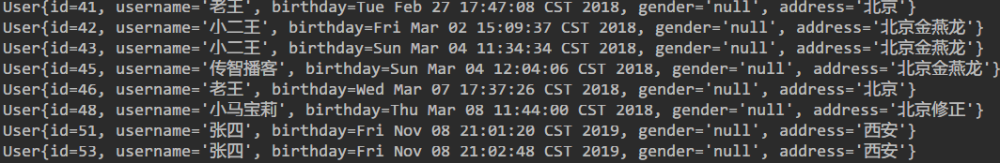
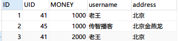

# MyBatis

方便地进行数据库读写

## 快速体验

*   新建`Maven`白板工程

*   编辑`pom.xml`文件，导入包

    ```xml
    <dependencies>
            <dependency>
                <groupId>org.mybatis</groupId>
                <artifactId>mybatis</artifactId>
                <version>3.4.5</version>
            </dependency>
            <dependency>
                <groupId>mysql</groupId>
                <artifactId>mysql-connector-java</artifactId>
                <version>5.1.32</version>
            </dependency>
            <dependency>
                <groupId>log4j</groupId>
                <artifactId>log4j</artifactId>
                <version>1.2.17</version>
            </dependency>
            <dependency>
                <groupId>junit</groupId>
                <artifactId>junit</artifactId>
                <version>4.12</version>
            </dependency>
        </dependencies>
    ```

    主要是`mybatis` \ `mysqlconnector` \ `junit` \ `log4j`四个包

*   `./src/main/java/com/zhang/domain/`建立`User`类

    ```java
    package com.zhang.domain;
    public class User {
        private Integer id;
        private String username;
        private Date birthday;
        private String sex;
        private String address;
        /*Getters Setters toString*/
    }
    ```

*   `./src/main/resources/`下建立`SqlMapConfig.xml`文件配置连接

    ```xml
    <configuration>
        <environments default="mysql">
            <environment id="mysql">
                <transactionManager type="JDBC"></transactionManager>
                <dataSource type="POOLED">
                    <property name="driver" value="com.mysql.jdbc.Driver"/>
                    <property name="url" value="jdbc:mysql://localhost:3306/test"/>
                    <property name="username" value="root"/>
                    <property name="password" value=""/>
                </dataSource>
            </environment>
        </environments>
        <mappers>
            <mapper resource="com/zhang/dao/UserDao.xml"/><!--指示查询配置文件的位置-->
        </mappers>
    </configuration>
    ```

*   `./src/main/resources/com/zhang/dao`下建立`UserDao.xml`,设置查询

    ```xml
    <mapper namespace="test"><!--设置命名空间-->
        <select id="findAll" resultType="com.zhang.domain.User"><!--resultType设置查询后要返回的对象-->
            select * from user
        </select>
        <select id="SelectById" parameterType="int" resultType="com.zhang.domain.User"><!--parameterType设置为查询参数的类型-->
            select * from user where id=#{value}
        </select>
        <select id="SelectByUsername" parameterType="String" resultType="com.zhang.domain.User">
            select * from user where username like '%${value}%'
        </select>
    </mapper>
    ```

*   `./src/test/java/`建立单元测试类`TestMyBatis`

    ```java
    public class TestMyBatis {
        @Test
        public void testSelectAll() throws Exception{
            String resource = "SqlMapConfig.xml";
            InputStream resourceAsStream = Resources.getResourceAsStream(resource);
            SqlSessionFactory build = new SqlSessionFactoryBuilder().build(resourceAsStream);
            SqlSession sqlSession = build.openSession();
            List<Object> objects = sqlSession.selectList("test.findAll");//命名空间+方法名
            for (Object each : objects) {
                System.out.println(each);
            }
            sqlSession.close();
            resourceAsStream.close();
        }
    /*已经测试过*/
        @Test
        public void testSelectById() throws Exception{
            String resource = "SqlMapConfig.xml";
            InputStream resourceAsStream = Resources.getResourceAsStream(resource);
            SqlSessionFactory build = new SqlSessionFactoryBuilder().build(resourceAsStream);
            SqlSession sqlSession = build.openSession();
            List<Object> objects = sqlSession.selectList("test.SelectById", 50);//命名空间+方法名，加上参数
            for (Object each : objects) {
                System.out.println(each);
            }
            sqlSession.close();
            resourceAsStream.close();
        }
        /*
        User{id=50, username='张一', birthday=Mon Nov 04 00:00:00 CST 2019, sex='男', address='西安'}
        */
        @Test
        public void testSelectByUsername() throws Exception{
            String resource = "SqlMapConfig.xml";
            InputStream resourceAsStream = Resources.getResourceAsStream(resource);
            SqlSessionFactory build = new SqlSessionFactoryBuilder().build(resourceAsStream);
            SqlSession sqlSession = build.openSession();
            List<Object> objects = sqlSession.selectList("test.SelectByUsername", "张");//经过测试，命名空间可以随意设置，目的是分开可能重名的方法
            for (Object each : objects) {
                System.out.println(each);
            }
            sqlSession.close();
            resourceAsStream.close();
        }
        /*
        User{id=50, username='张一', birthday=Mon Nov 04 00:00:00 CST 2019, sex='男', address='西安'}
    User{id=51, username='张二', birthday=Mon Nov 04 00:00:00 CST 2019, sex='女', address='西安'}
        */
    }
    ```
    
## 小问题

解决User类属性和数据库列名不一致的匹配问题

*   如果User类的性别属性名改为gender，再运行测试结果是这样的可以看到gender栏位为null

*   为此有两种解决方法

*   ```xml
    <select id="findAll" resultType="com.zhang.domain.User">
            select id, username, birthday, sex as gender, address  from user
    </select><!--这种最为简便-->
    ```

    ```xml
    <resultMap id="resultMap" type="com.zhang.domain.User">
            <result property="gender" column="sex"></result>
        </resultMap>
    <select id="findAll" resultMap="resultMap">
            select * from user
    </select><!--这种最为通用，通常用这种方法-->
    ```

*   方法一直接起别名，观察语句中的as，前面是sex，来自数据库，因为实体类要求是gender，所以封装为gender，简单快捷，效率也高，但是当要修改多行代码或栏位特别多时会很繁琐

*   方法二采用了resultMap，给查询下来的结果做转换，但是需要注意select标签的resultType属性不能像以前一样设置，需要设置为resultMap属性，效率稍显繁琐，但是比较通用，而且在应对许多查询语句时代码量比上一种方法简便

## 动态SQL

*   考虑需求为根据不同的给出条件选择出对应项，比如给username或者id、gender等，只用写一条查询应该怎么写

*   ```xml
    <!--
    ./src/main/resources/com/zhang/dao/UserDao.xml中追加
    -->
    <select id="SelectByRandom" resultMap="resultMap" parameterType="com.zhang.domain.User"><!--使用不同的参数来拼接，如果有名字就查询名字，有性别就查询性别-->
            select * from user
            <where>
                <if test="username != null">
                    and username = #{username}
                </if>
                <if test="gender != null">
                    and sex = #{gender}
                </if>
            </where><!--where和if标签的使用，test属性表示条件-->
        </select>
    ```

    ```java
    public class QueryVo {
        private User user;
    private List<Integer> ids;
        /*Getter Setter toString*/
	```
    
    
    ```java
    /*./src/test/java/TestMybatis.java追加内容*/
    @Test
        public void selectByQueryVo(){
            User user = new User();
            user.setUsername("%张%");
            QueryVo queryVo = new QueryVo();
            queryVo.setUser(user);
            List<Object> objects = sqlSession.selectList("test.SelectByQueryVo", queryVo);
            for (Object each : objects) {
                System.out.println(each);
            }
        }
    /*User{id=51, username='张四', birthday=Fri Nov 08 21:01:20 CST 2019, gender='null', address='西安'}
    User{id=53, username='张四', birthday=Fri Nov 08 21:02:48 CST 2019, gender='null', address='西安'}*/
    ```

*   给出一个id的集合，查询出在这个集合中的项，使用动态SQL

    ```xml
    <!--
    ./src/main/resources/com/zhang/dao/UserDao.xml中追加
    -->
    <select id="SelectUserInIds" resultMap="resultMap" parameterType="com.zhang.domain.QueryVo">
            select * from user
            <where>
                <if test="ids != null and ids.size()>0">
                    <foreach collection="ids" open="and id in (" close=")" item="id" separator=",">
                        #{id}
                    </foreach>
                </if>
            </where>
        </select>
    ```
    ```java
    /*./src/test/java/TestMybatis.java追加内容*/
    @Test
        public void testSelectUserInIds(){
            QueryVo queryVo = new QueryVo();
            List<Integer> ids = new ArrayList<Integer>();
            ids.add(41);
            ids.add(42);
            queryVo.setIds(ids);
            List<Object> objects = sqlSession.selectList("test.SelectUserInIds", queryVo);
            for (Object each : objects) {
                System.out.println(each);
            }
        }
    /*User{id=41, username='老王', birthday=Tue Feb 27 17:47:08 CST 2018, gender='男', address='北京'}
    User{id=42, username='小二王', birthday=Fri Mar 02 15:09:37 CST 2018, gender='女', address='北京金燕龙'}*/
    ```

## 一对多查询

*   一对多查询时需要设置`xml`文件

    ```xml
    <resultMap id="testMultiTable" type="com.zhang.domain.User">
            <id property="id" column="id"></id>
            <result property="username" column="username"></result>
            <result property="birthday" column="birthday"></result>
            <result property="gender" column="sex"></result>
            <result property="address" column="address"></result>
            <collection property="accounts" ofType="com.zhang.domain.Account">
                <id property="uid" column="uid"></id>
                <result property="money" column="money"></result>
                <result property="id" column="id"></result>
            </collection><!--id标签表示主键，而collection标签表示-->
        </resultMap>
        <select id="SelectMultiTable" resultMap="testMultiTable">
            select a.*, u.username, u.address from user u, account a where u.id=a.uid
        </select>
    ```

*   新建`Account.java`

    ```java
    public class Account {
        private Integer id;
        private Integer uid;
        private Integer money;
        private User user;//附表中应该添加主表
        /*Getters Setters toString*/
    }
    ```

*   SQL语句原始运行结果

*   测试代码

    ```java
    @Test
        public void testSelectMultiTable(){
            List<User> users = sqlSession.selectList("test.SelectMultiTable");
            for (User each : users) {
                System.out.println(each);
                System.out.println(each.getAccounts());
            }
        }
    /*结果为
    User{id=1, username='老王', birthday=null, gender='null', address='北京'}
    [Account{id=1, uid=41, money=1000, user=null}]
    User{id=2, username='传智播客', birthday=null, gender='null', address='北京金燕龙'}
    [Account{id=2, uid=45, money=1000, user=null}]
    User{id=3, username='老王', birthday=null, gender='null', address='北京'}
    [Account{id=3, uid=41, money=2000, user=null}]
    */
    ```

    