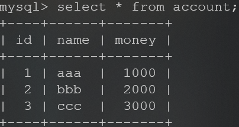

# Spring

非常成熟的框架，降低耦合

## 搭建环境

*   新建Maven白板工程，编辑pom文件导入spring-context

*   创建service层的接口与实现类

    ```java
    public interface AccountService {
        void saveAccount();
    }
    
    public class AccountServiceImpl implements AccountService {
        public AccountServiceImpl() {
            System.out.println("创建了AccountServiceImpl...");
        }
        public void saveAccount() {
            System.out.println("saveAccount...");
        }
    }
    ```

*   ```xml
    <?xml version="1.0" encoding="UTF-8"?>
    <beans xmlns="http://www.springframework.org/schema/beans"
           xmlns:xsi="http://www.w3.org/2001/XMLSchema-instance"
           xsi:schemaLocation="http://www.springframework.org/schema/beans
            http://www.springframework.org/schema/beans/spring-beans.xsd">
        <bean id="accountService" class="com.itheima.service.impl.AccountServiceImpl"></bean><!--指定实现类，并给一个id用来标明新建的类id-->
    </beans>
    ```

*   ```java
        @Test
        public void test1(){
            ApplicationContext ac = new ClassPathXmlApplicationContext("bean.xml");
            AccountService accountService = (AccountService) ac.getBean("accountService");
            System.out.println(accountService);
        }/*结果是
        创建了AccountServiceImpl...
    com.itheima.service.impl.AccountServiceImpl@305fd85d*/
    ```

    

## 创建Bean

三种方式来创建Bean

### 构造方法

```java
    public AccountServiceImpl() {
        System.out.println("创建了AccountServiceImpl...");
    }/*AccountService类中追加的无参构造*/
/*xml文件保持原样*/
```

```java
    @Test
    public void test2(){
        ApplicationContext ac = new ClassPathXmlApplicationContext("bean.xml");
        AccountService accountService = (AccountService) ac.getBean("accountService");
    }/*结果为
    创建了AccountServiceImpl...*/
```

### InstanceFactory

```java
public class InstanceFactory {
    public AccountService getAccountService(){
        System.out.println("执行了InstanceFactory");
        return new AccountServiceImpl();
    }
}/*这个不是真正的Factory，只是用来模拟*/
```

```xml
    <bean id="instanceFactory" class="com.itheima.factory.InstanceFactory"></bean>
    <bean id="accountService" factory-bean="instanceFactory" factory-method="getAccountService"></bean><!--指定了先创建InstanceFactory,再通过这个工程来创建，标签用来指定是哪个工厂，以及创建Bean的方法-->
```

```java
    @Test
    public void test2(){
        ApplicationContext ac = new ClassPathXmlApplicationContext("bean.xml");
        AccountService accountService = (AccountService) ac.getBean("accountService");
    }/*结果为
    执行了InstanceFactory
	创建了AccountServiceImpl...*/
```

### StaticFactory

```java
public class StaticFactory {
    public static AccountService getAccountService(){
        System.out.println("执行了StaticFactory");
        return new AccountServiceImpl();
    }
}
```

```xml
 <bean id="accountService" class="com.itheima.factory.StaticFactory" factory-method="getAccountService"></bean><!--静态工厂不需要手动创建-->
```

```java
    @Test
    public void test2(){
        ApplicationContext ac = new ClassPathXmlApplicationContext("bean.xml");
        AccountService accountService = (AccountService) ac.getBean("accountService");
    }/*结果为
    执行了StaticFactory
	创建了AccountServiceImpl...*/
```

## 依赖注入

将对象的创建交给Spring

### 构造函数注入


```java
public class AccountServiceImpl implements AccountService {
        private String name;
        private Integer age;
        private Date birthday;
        public void saveAccount() {
            System.out.println("saveAccount...");
        }
        /*Constructor toString*/
    }
    public interface AccountService {
        void saveAccount();
    }
```

```xml
<bean id="accountService" class="com.itheima.service.impl.AccountServiceImpl">
        <constructor-arg name="name" value="test"></constructor-arg>
        <constructor-arg name="age" value="13"></constructor-arg>
        <constructor-arg name="birthday" ref="now"></constructor-arg>
    </bean><!--标签指定了要创建的对象，以及他的id，而constructor-arg标签则指定了他们构造函数要创建的内容，使用name-value对来确定初始化哪个属性，其中，date因为需要转换而使用了ref标签，ref类型为其他Bean类型，需要注明id-->
<bean id="now" class="java.util.Date"></bean>
```

```java
@Before
public void init(){
    applicationContext = new ClassPathXmlApplicationContext("bean.xml");
}
@Test
public void testSDI(){
    accountService = (AccountService) applicationContext.getBean("accountService");
    accountService.saveAccount();
    System.out.println(accountService.toString());
}/*
        saveAccount...
    AccountServiceImpl{name='test', age=13, birthday=Sun Nov 17 11:09:49 CST 2019}*/
```

### set注入

```java
public class AccountServiceImpl2 implements AccountService {
    private String name;
    private Integer age;
    private Date birthday;
    public void saveAccount() {
    }
    /*toString Setters*/
}
```

```xml
    <bean id="accountService2" class="com.itheima.service.impl.AccountServiceImpl2">
        <property name="name" value="张一"></property>
        <property name="age" value="13"></property>
        <property name="birthday" ref="now"></property>
    </bean>
```

```java
    @Test
    public void testSetter(){
        accountService = (AccountService) applicationContext.getBean("accountService2");
        System.out.println(accountService);
    }/*AccountServiceImpl2{name='张一', age=13, birthday=Sun Nov 17 11:20:39 CST 2019}*/
```


### 注入集合

```java
public class AccountServiceImpl3 implements AccountService {
    private String[] myStrs;
    private List<String> myList;
    private Set<String> mySet;
    private Map<String, String> myMap;
    private Properties myProps;
    public void saveAccount() {
    }
    /*Getters Setters toString*/
```

```xml
<bean id="accountService3" class="com.itheima.service.impl.AccountServiceImpl3">
        <property name="myStrs">
            <set>
                <value>AAA</value>
                <value>BBB</value>
                <value>CCC</value>
            </set>
        </property>
        <property name="myList">
            <array>
                <value>AAA</value>
                <value>BBB</value>
                <value>CCC</value>
            </array>
        </property>
        <property name="mySet">
            <list>
                <value>AAA</value>
                <value>BBB</value>
                <value>CCC</value>
            </list>
        </property>
        <property name="myMap">
            <props>
                <prop key="testC">ccc</prop>
                <prop key="testD">ddd</prop>
            </props>
        </property>
        <property name="myProps">
            <map>
                <entry key="testA" value="aaa"></entry>
                <entry key="testB" value="BBB"></entry>
            </map>
        </property>
    </bean>
```

```java
    @Test
    public void testSets(){
        accountService = (AccountService) applicationContext.getBean("accountService3");
        System.out.println(accountService);
    }/*AccountServiceImpl3{myStrs=[AAA, BBB, CCC], myList=[AAA, BBB, CCC], mySet=[AAA, BBB, CCC], myMap={testD=ddd, testC=ccc}, myProps={testA=aaa, testB=BBB}}*/
```

## 使用注解

```java
@Repository("accountDao")//参数与注入的类名保持一致，以便于自动注入
public class AccountDaoImpl implements IAccountDao{
    public  void saveAccount(){
        System.out.println("保存了账户1");
    }
}

@Service("accountService")//一旦有这个注解就会执行这里面的方法
public class AccountServiceImpl implements IAccountService {
    @Autowired//使用自动注入
    private IAccountDao accountDao = null;
    public void  saveAccount(){
        accountDao.saveAccount();
    }
}

public static void main(String[] args) {
        ClassPathXmlApplicationContext ac = new ClassPathXmlApplicationContext("bean.xml");
        IAccountService as  = (IAccountService)ac.getBean("accountService");//accountService表示的是要执行哪个service层的方法，注解中可以看到
        as.saveAccount();
        ac.close();
    }
/*结果为
保存了账户1*/
/*
但是当出现要注入多个对象时，自动注入就会起到冲突，例如
*/
@Repository("accountDao2")
public class AccountDaoImpl2  implements IAccountDao {
    public  void saveAccount(){
        System.out.println("保存了账户2");
    }
}
/*再次增加一个Repository时，如果要指定Service创建这个对象，那么就必须改为这样*/
@Service("accountService")
public class AccountServiceImpl implements IAccountService {
    @Autowired
    private IAccountDao accountDao2 = null;
    public void  saveAccount(){
        accountDao2.saveAccount();
    }
}/*显得比较麻烦，那么解决方法如下*/
@Service("accountService")
public class AccountServiceImpl implements IAccountService {
    @Autowired
    @Qualifier("accountDao2")
    private IAccountDao accountDao = null;
    public void  saveAccount(){
        accountDao.saveAccount();
    }
}/*连续使用AutoWired和Qualifier注解，其中Qualifier注解的参数用来设置id，所以要创建哪个Repository直接将其设置为类名即可，或者也可以使用Resource注解*/
    @Resource(name = "accountDao2")
    private IAccountDao accountDao = null;
/*直接指定属性name值为要创建的类名*/
/*还有关于作用范围的注解
scope preDestroy postConstruct*/

@Scope(value = "prototype")//value默认为singleton，可以取值为singleton或prototype，表示单例或多例模式
public class AccountServiceImpl implements IAccountService
IAccountService as  = (IAccountService)ac.getBean("accountService");
IAccountService as2  = (IAccountService)ac.getBean("accountService");
System.out.println(as == as2);//false 如果value设置为singleton则为true

public class AccountServiceImpl implements IAccountService {
    @Resource(name = "accountDao2")
    private IAccountDao accountDao = null;
    @PostConstruct
    public void  init(){
        System.out.println("init...");
    }
    @PreDestroy
    public void  destroy(){
        System.out.println("destroy...");
    }
    public void  saveAccount(){
        accountDao.saveAccount();
    }
}/*结果为
init...
保存了账户2
destroy...*/
```

>   第12周

## 案例：从零使用spring/c3p0实现前后交互

*   开始构建一个maven工程，编辑pom文件引入spring-context/commons-dbutils/mysql-connector/c3p0/junit

*   交互的数据库是这样的

*   创建对应的实体类`./src/main/java/com/itheima/domain/Account.java`

    ```java
    public class Account {
        private Integer id;
        private String name;
        private Float money;
        /*Getters Setters toString*/
    }
    ```

*   配置service层`./src/main/java/com/itheima/service/IAccountService.java`

    ```java
    public interface IAccountService {
        List<Account> findAllAccount();
        Account findAccountById(Integer accountId);
        void saveAccount(Account account);
        void updateAccount(Account account);
        void deleteAccount(Integer accountId);
    }
    ```

    `./src/main/java/com/itheima/service/impl/AccountService.java`

    ```java
    public class AccountServiceImpl implements IAccountService {
        private IAccountDao accountDao;
        public void setAccountDao(IAccountDao accountDao) {
            this.accountDao = accountDao;
        }
        public List<Account> findAllAccount() {
            return accountDao.findAllAccount();
        }
        public Account findAccountById(Integer accountId) {
            return accountDao.findAccountById(accountId);
        }
        public void saveAccount(Account account) {
            accountDao.saveAccount(account);
        }
        public void updateAccount(Account account) {
            accountDao.updateAccount(account);
        }
        public void deleteAccount(Integer accountId) {
            accountDao.deleteAccount(accountId);
        }
    }
    ```

*   配置dao层`./src/main/java/com/itheima/dao/IAccountDao.java`

    ```java
    public interface IAccountDao {
        List<Account> findAllAccount();
        Account findAccountById(Integer accountId);
        void saveAccount(Account account);
        void updateAccount(Account account);
        void deleteAccount(Integer accountId);
    }
    ```

    `./src/main/java/com/itheima/dao/impl/AccountDaoImpl.java`

    ```java
    public class AccountDaoImpl implements IAccountDao {
        private QueryRunner queryRunner;
        public void setQueryRunner(QueryRunner queryRunner) {
            this.queryRunner = queryRunner;
        }
        public List<Account> findAllAccount() {
            try{
                return queryRunner.query("select * from account",new BeanListHandler<Account>(Account.class));
            }catch (Exception e) {
                throw new RuntimeException(e);
            }
        }
        public Account findAccountById(Integer accountId) {
            try {
                return queryRunner.query("select * from account where id=?", new BeanHandler<Account>(Account.class), accountId);
            } catch (SQLException e) {
                throw new RuntimeException(e);
            }
        }
        public void saveAccount(Account account) {
            try {
                queryRunner.update("insert into account(name, money) values (?, ?)", account.getName(), account.getMoney());
            } catch (SQLException e) {
                throw new RuntimeException(e);
            }
        }
        public void updateAccount(Account account) {
            try {
                queryRunner.update("update account set name=?, money=? where id=?", account.getName(), account.getMoney(), account.getId());
            } catch (SQLException e) {
                throw new RuntimeException(e);
            }
        }
        public void deleteAccount(Integer accountId) {
            try {
                queryRunner.update("delete from account where id=?", accountId);
            } catch (SQLException e) {
                throw new RuntimeException(e);
            }
        }
    }/*/impl/AccountDaoImpl.java*/
    ```

*   配置参数`./src/main/resources/bean.xml`

    ```xml
    <bean id="accountService" class="com.itheima.service.impl.AccountServiceImpl">
            <property name="accountDao" ref="accountDao"></property>
        </bean>
        <bean id="accountDao" class="com.itheima.dao.impl.AccountDaoImpl">
            <property name="queryRunner" ref="queryRunner"></property>
        </bean>
        <bean id="queryRunner" class="org.apache.commons.dbutils.QueryRunner" scope="prototype">
            <constructor-arg name="ds" ref="dataSource"></constructor-arg>
        </bean>
        <bean id="dataSource" class="com.mchange.v2.c3p0.ComboPooledDataSource">
            <property name="driverClass" value="com.mysql.jdbc.Driver"></property>
            <property name="jdbcUrl" value="jdbc:mysql://localhost:3306/test1120"></property>
            <property name="user" value="root"></property>
            <property name="password" value=""></property>
        </bean>
    ```

*   测试类`./src/test/java/com/itheima/AccountServiceTest.java`

    ```java
    public class AccountServiceTest {
        @Test
        public void testFindAllAccount() {
            ApplicationContext ac = new ClassPathXmlApplicationContext("bean.xml");
            IAccountService accountService = ac.getBean("accountService", IAccountService.class);
            List<Account> allAccount = accountService.findAllAccount();
            for(Account each : allAccount){
                System.out.println(each);
            }
        }/*
        Account{id=1, name='aaa', money=1000.0}
    Account{id=2, name='bbb', money=2000.0}
    Account{id=3, name='ccc', money=3000.0}
    Account{id=5, name='Zhang', money=1234.0}*/
        @Test
        public void testFindAccountById() {
            ApplicationContext ac = new ClassPathXmlApplicationContext("bean.xml");
            IAccountService accountService = ac.getBean("accountService", IAccountService.class);
            Account accountById = accountService.findAccountById(5);
            System.out.println(accountById);
        }/*Account{id=5, name='Zhang', money=1234.0}
        */
        @Test
        public void testSaveAccount() {
            ApplicationContext ac = new ClassPathXmlApplicationContext("bean.xml");
            IAccountService accountService = ac.getBean("accountService", IAccountService.class);
            Account account = new Account();
            account.setMoney(1234f);
            account.setName("Zhang");
            accountService.saveAccount(account);
        }/*Account{id=1, name='aaa', money=1000.0}
    Account{id=2, name='bbb', money=2000.0}
    Account{id=3, name='ccc', money=2345.0}
    Account{id=5, name='Zhang', money=1234.0}*/
        @Test
        public void testUpdateAccount() {
            ApplicationContext ac = new ClassPathXmlApplicationContext("bean.xml");
            IAccountService accountService = ac.getBean("accountService", IAccountService.class);
            Account accountById = accountService.findAccountById(4);
            accountById.setMoney(2345f);
            accountService.updateAccount(accountById);
        }/*Account{id=1, name='aaa', money=1000.0}
    Account{id=2, name='bbb', money=2000.0}
    Account{id=3, name='ccc', money=2345.0}
    Account{id=5, name='Zhang', money=1234.0}*/
        @Test
        public void testDeleteAccount() {
            ApplicationContext ac = new ClassPathXmlApplicationContext("bean.xml");
            IAccountService accountService = ac.getBean("accountService", IAccountService.class);
            accountService.deleteAccount(4);
        }/*Account{id=1, name='aaa', money=1000.0}
    Account{id=2, name='bbb', money=2000.0}
    Account{id=3, name='ccc', money=2345.0}*/
    }
    ```
    
    ### 使用注解实现
    
    `./src/main/resource/bean_anno.xml`
    
    ```xml
        <context:component-scan base-package="com.itheima"></context:component-scan>
        <bean id="queryRunner" class="org.apache.commons.dbutils.QueryRunner">
        <constructor-arg name="ds" ref="dataSource"></constructor-arg>
        </bean>
    
        <bean id="dataSource" class="com.mchange.v2.c3p0.ComboPooledDataSource">
            <property name="driverClass" value="com.mysql.jdbc.Driver"></property>
            <property name="jdbcUrl" value="jdbc:mysql://localhost:3306/test1120"></property>
            <property name="user" value="root"></property>
            <property name="password" value=""></property>
        </bean><!--相比于上面的少了accountService和accountDao两个bean的实现-->
    ```
    
    `./src/main/java/com/itheima/service/impl/AccountServiceImpl.java`
    
    ```java
    @Service(value = "accountService")//标明是Service的bean对象，名为accountService
    public class AccountServiceImpl implements IAccountService {
        @Autowired
        private AccountDaoImpl accountDao;
    //    由于是autowired自动注入所以不用setter
    //    public void setAccountDao(AccountDao accountDao) {
    //        this.accountDao = accountDao;
    //    }
        public List<Account> selectAll() {
            return accountDao.selectAll();
        }
    }
    ```
    
    `./src/main/java/com/itheima/dao/impl/AccountDaoImpl.java`
    
    ```java
    @Repository(value = "accountDao")//标明是repository对象，名为accountDao
    public class AccountDaoImpl implements IAccountDao {
        @Autowired
        private QueryRunner queryRunner ;
    /*由于是autowired自动注入所以不用setter
        public void setQueryRunner(QueryRunner queryRunner) {
            this.queryRunner = queryRunner;
        }
    */
        public List<Account> selectAll() {
            try {
                return queryRunner.query("select * from account", new BeanListHandler<Account>(Account.class));
            } catch (SQLException e) {
                throw new RuntimeException(e);
            }
        }
    }
    ```
    
    `./src/test/java/com/itheima/TestSpring.java`
    
    ```java
    public class TestSpring {
        @Test
        public void testSelectAllAnno(){
            ApplicationContext ac = new ClassPathXmlApplicationContext("bean_anno.xml");
            IAccountService accountService = ac.getBean("accountService", IAccountService.class);
            List<Account> accounts = accountService.selectAll();
            for(Account each : accounts){
                System.out.println(each);
            }
        }/*Account{id=1, name='aaa', moneyh=1000.0}
    Account{id=2, name='bbb', moneyh=2000.0}
    Account{id=3, name='ccc', moneyh=2345.0}*/
    }
    ```
    
    ## 使用新注解
    
    新建两个类
    
    `./src/main/java/com/itheima/config/SpringConfiguration.java`
    
    ```java
    @ComponentScan(basePackages = "com.itheima")
    @Import(JDBCConfiguration.class)
    @PropertySource("classpath:jdbcConfig.properties")
    public class SpringConfiguration {/**/
    }
    ```
    
    `./src/main/java/com/itheima/config/JDBCCOnfiguration.java`
    
    ```java
    public class JDBCConfiguration {
        @Value("${jdbc.driver}")
        private String driver;
        @Value("${jdbc.url}")
        private String url;
        @Value("${jdbc.username}")
        private String username;
        @Value("${jdbc.password}")
        private String password;
        @Bean(name = "queryRunner")
        @Scope("prototype")
        public QueryRunner createQueryRunner(DataSource dataSource){
            return new QueryRunner(dataSource);
        }
        @Bean(name = "dataSource")
        public DataSource createDataSource(){
            try{
                ComboPooledDataSource comboPooledDataSource = new ComboPooledDataSource();
                comboPooledDataSource.setDriverClass(driver);
                comboPooledDataSource.setJdbcUrl(url);
                comboPooledDataSource.setUser(username);
                comboPooledDataSource.setPassword(password);
                return comboPooledDataSource;
            } catch (Exception e){
                throw new RuntimeException(e);
            }
        }
    }
    ```
    
    `./src/main/resources/jdbcConfig.properties`
    
    ```properties
    jdbc.driver=com.mysql.jdbc.Driver
    jdbc.url=jdbc:mysql://localhost:3306/test1120
    jdbc.username=root
    jdbc.password=
    ```
    
    还可以使用Spring与JUnit的结合Runner来运行单元测试
    
    `./src/test/java/com/itheima/TestSpring.java`
    
    ```java
    @RunWith(SpringJUnit4ClassRunner.class)
    @ContextConfiguration(classes = SpringConfiguration.class)
    public class TestSpring {
        @Autowired
        private IAccountService accountService;//使用了结合的Runner才能确保Autowired注解正常注入
        @Test
        public void testSelectAllAnno(){/*不需要再繁琐的手动读取xml等操作*/
            List<Account> accounts = accountService.selectAll();
            for(Account each : accounts){
                System.out.println(each);
            }
        }/*Account{id=1, name='aaa', moneyh=1000.0}
    Account{id=2, name='bbb', moneyh=2000.0}
    Account{id=3, name='ccc', moneyh=2345.0}*/
    }
    ```

## 转账案例

使用事务回滚应对异常

`./src/main/java/com/itheima/domain/Account.java`

```java
public class Account {
    private Integer id;
    private String name;
    private float money;
    /*Getters Setters toString*/
}
```

`./src/main/java/com/itheima/service/IAccountService.java`

```java
public interface IAccountService {
    List<Account> selectAll();
    Account selectById(Integer id);
    void saveAccount(Account account);
    void updateAccount(Account account);
    void deleteAccount(Integer id);
    Account selectByName(String name);
    void transfer(String transferOutName, String transferInName, float transferAmount);/*转账*/
}
```

`./src/main/java/com/itheima/service/impl/AccountServiceImpl.java`

```java
public class AccountServiceImpl implements IAccountService {

    private IAccountDao iAccountDao;
    private TransactionManager transactionManager;

    public void setTransactionManager(TransactionManager transactionManager) {
        this.transactionManager = transactionManager;
    }

    public void setiAccountDao(IAccountDao iAccountDao) {
        this.iAccountDao = iAccountDao;
    }
    public List<Account> selectAll() {/*...*/}
    public Account selectById(Integer id) {/*...*/}
    public void saveAccount(Account account) {/*...*/}
    public void updateAccount(Account account) {/*...*/}
    public void deleteAccount(Integer id) {/*...*/}
    public Account selectByName(String name) {/*...*/}

    public void transfer(String transferOutName, String transferInName, float transferAmount) {
        try {
            transactionManager.beginTransaction();
            Account transferOuter = iAccountDao.selectByName(transferOutName);
            Account transferIner = iAccountDao.selectByName(transferInName);
            transferOuter.setMoney(transferOuter.getMoney() - transferAmount);
            transferIner.setMoney(transferIner.getMoney() + transferAmount);
            iAccountDao.updateAccount(transferIner);
            int i = 1 / 0;/*设定异常*/
            iAccountDao.updateAccount(transferOuter);
            transactionManager.commit();
        } catch (Exception e) {
            transactionManager.rollback();
            throw new RuntimeException(e);
        } finally {
            transactionManager.release();
        }
    }
}
```

`./src/main/java/com/itheima/dao/IAccountDao.java`

```java
public interface IAccountDao {
    List<Account> selectAll();
    Account selectById(Integer id);
    void saveAccount(Account account);
    void updateAccount(Account account);
    void deleteAccount(Integer id);
    Account selectByName(String name);
}
```

`./src/main/java/com/itheima/dao/impl/AccountDaoImpl.java`

```java
public class AccountDaoImpl implements IAccountDao {
    private QueryRunner queryRunner;
    private ConnectionUtils connectionUtils;
    public void setConnectionUtils(ConnectionUtils connectionUtils) {
        this.connectionUtils = connectionUtils;
    }
    public void setQueryRunner(QueryRunner queryRunner) {
        this.queryRunner = queryRunner;
    }
    public List<Account> selectAll() {
        try {
            return queryRunner.query(connectionUtils.getThreadConnection(), "select * from account", new BeanListHandler<Account>(Account.class));
        } catch (SQLException e) {
            throw new RuntimeException(e);
        }
    }
    public Account selectById(Integer id) {
        try {
            return queryRunner.query(connectionUtils.getThreadConnection(), "select * from account where id=?", new BeanHandler<Account>(Account.class), id);
        } catch (SQLException e) {
            throw new RuntimeException(e);
        }
    }
    public void saveAccount(Account account) {
        try {
            queryRunner.update(connectionUtils.getThreadConnection(), "insert into account(name, money) values (?, ?)", account.getName(), account.getMoney());

        } catch (SQLException e) {
            throw new RuntimeException(e);
        }
    }
    public void updateAccount(Account account) {
        try {
            queryRunner.update(connectionUtils.getThreadConnection(), "update account set name=?, money=? where id=?", account.getName(), account.getMoney(), account.getId());
        } catch (SQLException e) {
            throw new RuntimeException(e);
        }
    }
    public void deleteAccount(Integer id) {
        try {
            queryRunner.update(connectionUtils.getThreadConnection(), "delete from account where id=?", id);
        } catch (SQLException e) {
            throw new RuntimeException(e);
        }
    }
    public Account selectByName(String name) {
        try {
            Account account = queryRunner.query(connectionUtils.getThreadConnection(),"select * from account where name=?", new BeanHandler<Account>(Account.class), name);
            return account;
        } catch (SQLException e) {
            throw new RuntimeException(e);
        }
    }
}
```

`./src/main/java/com/itheima/utils/ConnectionUtils.java`

```java
public class ConnectionUtils {
    private ThreadLocal<Connection> tl = new ThreadLocal<Connection>();
    private DataSource dataSource;
    public void setDataSource(DataSource dataSource) {
        this.dataSource = dataSource;
    }
    public Connection getThreadConnection(){
        try {
            Connection connection = tl.get();
            if(connection == null){
                connection = dataSource.getConnection();
                tl.set(connection);
            }
            return connection;
        } catch (Exception e){
            throw new RuntimeException(e);
        }
    }
    public void removeConnection(){
        tl.remove();
    }
}
```

`./src/main/java/com/itheima/utils/TransactionManager.java`

```java
public class TransactionManager {
    private ConnectionUtils connectionUtils;
    public void setConnectionUtils(ConnectionUtils connectionUtils) {
        this.connectionUtils = connectionUtils;
    }
    public void beginTransaction(){
        try {
            connectionUtils.getThreadConnection().setAutoCommit(false);
        } catch (SQLException e) {
            e.printStackTrace();
        }
    }
    public void commit(){
        try {
            connectionUtils.getThreadConnection().commit();
        } catch (SQLException e) {
            e.printStackTrace();
        }
    }
    public void rollback(){
        try {
            connectionUtils.getThreadConnection().rollback();
        } catch (SQLException e) {
            e.printStackTrace();
        }
    }
    public void release(){
        try {
            connectionUtils.getThreadConnection().close();
            connectionUtils.removeConnection();
        } catch (SQLException e) {
            e.printStackTrace();
        }
    }
}
```

`./src/main/resources/Beans.xml`

```xml
<?xml version="1.0" encoding="UTF-8"?>
<beans xmlns="http://www.springframework.org/schema/beans"
       xmlns:xsi="http://www.w3.org/2001/XMLSchema-instance"
       xsi:schemaLocation="http://www.springframework.org/schema/beans
        http://www.springframework.org/schema/beans/spring-beans.xsd">
    <bean id="accountService" class="com.itheima.service.impl.AccountServiceImpl">
        <property name="iAccountDao" ref="accountDao"></property>
        <property name="transactionManager" ref="transactionManager"></property>
    </bean>
    <bean id="accountDao" class="com.itheima.dao.impl.AccountDaoImpl">
        <property name="queryRunner" ref="queryRunner"></property>
        <property name="connectionUtils" ref="connectionUtils"></property>
    </bean>
    <bean id="queryRunner" class="org.apache.commons.dbutils.QueryRunner">
        <constructor-arg name="ds" ref="dataSource"></constructor-arg>
    </bean>
    <bean id="dataSource" class="com.mchange.v2.c3p0.ComboPooledDataSource">
        <property name="driverClass" value="com.mysql.jdbc.Driver"></property>
        <property name="jdbcUrl" value="jdbc:mysql://localhost:3306/test1120"></property>
        <property name="user" value="root"></property>
        <property name="password" value=""></property>
    </bean>
    <bean id="connectionUtils" class="com.itheima.utils.ConnectionUtils">
        <property name="dataSource" ref="dataSource"></property>
    </bean>
    <bean id="transactionManager" class="com.itheima.utils.TransactionManager">
        <property name="connectionUtils" ref="connectionUtils"></property>
    </bean>
</beans>
```

./src/test/java/com/itheima/TestSpring.java

```java
@RunWith(SpringJUnit4ClassRunner.class)
@ContextConfiguration(locations = "classpath:Beans.xml")
public class TestSpring {
    @Autowired
    private IAccountService iAccountService = null;
	@Test
    public void testSelectAll(){
        List<Account> accounts = iAccountService.selectAll();
        for(Account each : accounts){
            System.out.println(each);
        }
    }
    @Test
    public void testTransfer(){
        System.out.println("************************转账前****************************");
        testSelectAll();
        System.out.println("*********************************************************");
        iAccountService.transfer("aaa", "bbb", 10.0f);
        System.out.println("************************转账后****************************");
        testSelectAll();
        System.out.println("*********************************************************");
    }
}
/*结果为
************************转账前****************************
Account{id=1, name='aaa', money=960.0}
Account{id=2, name='bbb', money=990.0}
Account{id=3, name='ccc', money=2345.0}
*********************************************************
java.lang.RuntimeException: java.lang.ArithmeticException: / by zero
Process finished with exit code -1

再次查询数据库发现为
Account{id=1, name='aaa', money=960.0}
Account{id=2, name='bbb', money=990.0}
Account{id=3, name='ccc', money=2345.0}
与之前结果一致，说明使用了事务，当出现异常时回滚*/
```


## 使用通知


*   ./src/main/java/com/itheima/utils/Logger.java

    ```java
    public class Logger {
        public void beforePrintLog(){/*前置通知*/
            System.out.println("Logger.beforePrintLog...");
        }
        public void afterReturningPrintLog(){/*后置通知*/
            System.out.println("Logger.afterReturningPrintLog...");
        }
        public void afterThrowingPrintLog(){/*异常通知*/
            System.out.println("Logger.afterThrowingPrintLog...");
        }
        public void afterPrintLog(){/*最终通知*/
            System.out.println("Logger.afterPrintLog...");
        }
    }
    ```

*   在./src/main/resources/Beans.xml中添加下面的数据

    ```xml
    <aop:config>
        <aop:aspect id="logAdvice" ref="logger">
            <aop:before method="beforePrintLog" pointcut-ref="pointcut1">		</aop:before><!--表示前置通知-->
            <aop:after-returning method="afterReturningPrintLog" pointcut-ref="pointcut1"></aop:after-returning><!--表示后置通知-->
            <aop:after-throwing method="afterThrowingPrintLog" pointcut-ref="pointcut1"></aop:after-throwing><!--表示异常通知-->
            <aop:after method="afterPrintLog" pointcut-ref="pointcut1"></aop:after><!--表示最终通知-->
            <aop:pointcut id="pointcut1" expression="execution(* com.itheima.service.impl.*.*(..))"/><!--使用通配符来通配所有返回值，所有方法名和参数-->
        </aop:aspect>
    </aop:config>
    ```

*   ```java
    	@Test
        public void testAop(){
            ApplicationContext applicationContext = new ClassPathXmlApplicationContext("Beans.xml");
            IAccountService iAccountService = (IAccountService) applicationContext.getBean("accountService");
            List<Account> accounts = iAccountService.selectAll();
        }/*
        Logger.beforePrintLog...
    	Logger.afterReturningPrintLog...
    	Logger.afterPrintLog...
    	由于并没有异常所以没有异常通知
        */
    ```

*   使用环绕通知，在Logger类添加如下内容

    ```java
    public Object aroundPringLog(ProceedingJoinPoint proceedingJoinPoint){
            Object returnValue = null;
            try {
                Object[] args = proceedingJoinPoint.getArgs();
                System.out.println("Logger.aroundPringLog...Before");
                proceedingJoinPoint.proceed(args);
                System.out.println("Logger.aroundPringLog...AfterReturning");
                return returnValue;
            } catch (Throwable throwable) {
                System.out.println("Logger.aroundPringLog...AfterThrowing");
                throw new RuntimeException(throwable);
            } finally {
                System.out.println("Logger.aroundPringLog...After");
            }
        }
    ```

*   改写Beans.xml

    ```xml
    <aop:config>
            <aop:aspect id="logAdvice" ref="logger">
    <!--            <aop:before method="beforePrintLog" pointcut-ref="pointcut1"></aop:before>-->
    <!--            <aop:after-returning method="afterReturningPrintLog" pointcut-ref="pointcut1"></aop:after-returning>-->
    <!--            <aop:after-throwing method="afterThrowingPrintLog" pointcut-ref="pointcut1"></aop:after-throwing>-->
    <!--            <aop:after method="afterPrintLog" pointcut-ref="pointcut1"></aop:after>-->
                <aop:around method="aroundPringLog" pointcut-ref="pointcut1"></aop:around>
                <aop:pointcut id="pointcut1" expression="execution(* com.itheima.service.impl.*.*(..))"/>
            </aop:aspect>
        </aop:config>
    ```

*   ```java
        @Test
        public void testAop(){
            ApplicationContext applicationContext = new ClassPathXmlApplicationContext("Beans.xml");
            IAccountService iAccountService = (IAccountService) applicationContext.getBean("accountService");
            List<Account> accounts = iAccountService.selectAll();
        }
    ```

    


