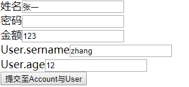

# SpringMVC


## 利用请求对应实体类

`/cn/itcast/domain/Account.java`

```java
public class Account {
    private String username;
    private String password;
    private Double money;
    User user;
    /*Getters Setters toString*/
}
```

`/cn/itcast/domain/User.java`

```java
public class User {
    private String username;
    private Integer age;
    /*Gettes Setters toString*/
}
```

`/cn/itcast/controller/ParamController.java`

```java
@Controller
public class ParamController {
    @RequestMapping("saveAccount")
    public String saveAccount(Account account){
        System.out.println("ParamController.saveAccount...");
        System.out.println(account);
        return "Success";
    }
}
```

`/index.jsp`

```jsp
<form action="saveAccount" method="post">
    姓名<input type="text" name="username"/><br/>
    密码<input type="password" name="password"/><br/>
    金额<input type="text" name="money"/><br/>
    User.sername<input type="text" name="User.username"/><br/>
    User.age<input type="text" name="User.age"/><br/>
    <input type="submit" value="提交至Account与User">
</form>
```

部署完成后进入页面`localhost:8080/LearnSpringmvc_war_exploded/`

点击提交后控制台输出

`ParamController.saveAccount...
Account{username='张一', password='zhangyihang', money=123.0, user=User{username='zhang', age=12}}`