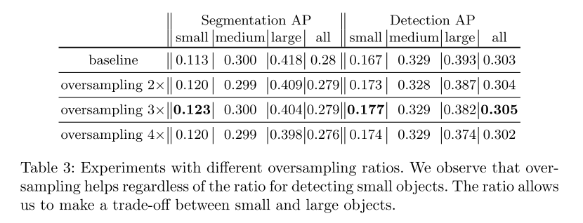

# Augmentation for small object detection
## Abstract
这些年来，目标检测取得了令人瞩目的成就
尽管改进很大，但对于小目标和大目标的检测性能差异还是很大
在 MS COCO 数据集上分析了如今一个比较先进的算法，Mask-RCNN
发现小目标的 GT 和检测框之间 IOU 远小于期望的阈值（比如0.5）
我们推测这是由于两个因素
* 包含小目标的图片的数量很少
* 即使每张图片里都有小目标，这些小目标在整图中占比也太少了
  

因此提出两个方式
* 对这些包含小目标的图像进行 oversample
* 通过多次复制粘贴小目标的方式来 augment 包含小目标的每张图片

通过这种方式可以增强小目标的检测性能
实验了不同的 pasting augumentation 策略
最终，我们在实例分割任务上获得了 9.7% 的提升，在检测任务中获得了 7.1% 的性能提升

## Introdunction

目标检测是当今计算机视觉研究的基本任务之一，因为它往往是许多现实应用的起点，包括机器人和自动驾驶、卫星和航空图像分析，以及医学图像中器官和物体的定位

小目标检测是许多下游任务的关键
* 在自动驾驶领域，从汽车的高分辨率场景照片中检测小的或者远的物体是必要的。例如交通灯、行人通常在高分辨率图像中经过缩放后就瞅不见了
* 对于医疗图像，早期检测到肿块和肿瘤是准确诊断的关键，而在早期诊断时，这样的元素很容易只有几个像素
* 工业自动检测同样需要小目标检测来定位材料表面可见的小缺陷。对于卫星图像分析，图像中的目标例如车、船、马等都需要详细的标注

这些图像的分辨率范围为 0.5−5m，然而对应的目标则可能只有几十甚至几个像素。换句话说，随着更复杂的系统在现实世界中部署，小目标检测和分割需要更多的关注

MS COCO 目标检测大赛的第一名解决方案从2015年的 mAP=0.373 提升到了2017年的 mAP=0.525
在MS COCO实例分割挑战下的实例分割问题中也可以看到类似的进展
尽管有这些改进，现有的解决方案在处理小目标时往往表现不佳

>
>界定目标大小划分规则

>
>列举了几个实例分割算法的结果

明显看出各种模型在小目标和大目标的检测性能上的显著差距

 具体的，看看Mask-RCNN 的检测结果

>
>来自Mask-RCNN的预测，系统遗漏了许多小物体，尽管在图中非常清晰
>在数百只鸟中只检测到六只鸟

这里，我们的实验室基于 MS COCO 数据集和 Mask R-CNN展开的
关于数据集，我们注意到它有两个特点

* 该数据集中包含小目标的图像相对较少，那么可能会导致训练出来的模型更关注于中、大目标的检测

* 小目标覆盖的面积很小，这意味着小目标出现的位置缺乏多样性
  我们目测，当模型较少的探索这些区域时，会使得检测模型很难推广到小目标

解决方式

-   对于第一个问题，我们通过对包含小目标的图像进行 oversampling 来解决

-   对于第二个问题，我们通过在每个包含小目标的图像中多次复制粘贴小目标来处理。复制目标时，我们确保不会和已经存在的目标有任何交叠。这增加了小目标位置的多样性，同时确保这些目标出现在正确的上下文中

    

>
>通过复制粘贴小对象进行人工增强的示例
>正如在这些示例中所观察到的，粘贴同一图像很有可能会正确显示小对象的周围环境

##  Related Work

### Object Detection

Faster RCNN R-FCN SSD

### Instance Segmentation

### Small objects

## Identifying issues with detecting small objects

 这一节，首先概述 MS COCO 数据和实验中用到的目标检测方法，然后讨论 MS COCO 数据集和使用 anchor 类方法的问题。它们都是增加小目标检测难度的原因 

* MS COCO

我们使用 MS COCO 检测数据集进行了实验，MS COCO 2017 检测数据集包含 118287 张训练图片、5000 张验证图片和 40670 张测试图片。包含了 80 个类别的 860,001 和 36,781 个目标用 ground-truth 边界框和实例掩码进行了标注。

　　在 MS COCO 检测任务中,主要的评价指标是平均精度(AP),AP 是 precision/recall 曲线的一种定量表达。一个 TP,不仅要分类正确还要回归足够好，比如检测框和 GT 的 交并比 (IoU) 要大于0.5。AP分数是80个类别和10个IoU阈值的平均值，平均分布在0.5和0.95之间。 指标还包括在不同对象比例下测量的测量的AP。 本文中, 我们首要关注的是小目标的 AP。

* Mask R-CNN

本实验利用 Detectron[19] 框架下的 Mask R-CNN 实现，使用 ResNet-50 backbone 和 [20] 中提出的线性缩放规则来设置学习超参数。我们设置初始学习率 0.01，利用分布式 GPUs 训练迭代 36k次。优化方面，我们使用动量设置为0.9的随机梯度下降和系数设置为0.0001的权重衰减。 训练过程中学习率分别在 24K 和 32K 次时按照 0.1 的比例降低两次。其他参数设置参考 Detectron - Mask R-CNN+FPN+ResNet-50 下的设置。

在我们的调研中发现候选区域阶段特别重要。我们采用 FPN 来生成 object proposals。它定义了 5 个尺度(322\642\1282\2562\5122) 3 个宽高比(1\0:5\2) 一共 15 个anchor 来构成 object proposals.与GT的IoU≥0.7的anchor或者 GT 能匹配到的最大IoU的anchor作为正样本

* Small object detection by Mask R-CNN on MS COCO

 　在 MS COCO 中，训练集中出现的所有目标中有 41.43%是小的，而只有 34.4%和 24.2% 分别是中型和大型目标。另一方面，只有约一半的训练图片包含任何小物体，而 70.07%和 82.28%的训练图像分别包含中型和大型物体。这说明了小对象检测问题背后的第一个问题：使用小对象的示例较少。 
>
>基于RPN的Mask-RCNN中与匹配锚有关的MS COCO数据集对象统计

随着而来的是第二个问题，不同大小的目标的 *Total Object Area* 差异很大。只有1.23%的标注像素属于小目标。中型目标占比10.18%，是小目标的十倍。而有 82.28%的占比属于大目标。任何在此数据集上训练的检测器都不能看到足够多的小对象，无论是跨图像还是跨像素。

将anchor和GT匹配后，匹配 IoU≥0.7的 anchor 会作为正样本参与训练。这种匹配方式更倾向于大目标，这就造成了小目标匹配少、大目标匹配多的不平衡性。

就像 Table 2 中描述的一样，对于小目标只有 29.96%的 anchor 能与之匹配，而有44.49%的 anchor 能与大目标匹配上。从另一个角度来看，这意味着每个大目标有 2.54 个匹配 anchor，而每一个小目标只有 1 个匹配 anchor。

AverageMaxIoU指标所示，即使是小对象的最佳匹配 anchor 通常也具有较低的 IoU。

在Figure 5 中，我们可视化了这个现象。这些观察表明，小目标对计算 region proposal 损失的贡献要小得多，这使得整个网络偏向于大中型目标.

>
>在Mask-RCNN网络中训练期间，已将锚定明确分配给（IoU> 0.5）到地面真实对象。 即使IoU低于阈值，也必须强制将至少一个锚点积极地分配给每个地面真实对象。 否则，如前两个图像一样，大多数小物体将被遗漏并且永远不会被训练。 其他图像正在验证我们正在解决的问题。 大对象比小对象具有更多的正分配锚。

## Oversampling and Augmentation

* 针对上文中提出的 MS COCO 数据的问题进行改进以提升小目标的性能。
  * 具体的，我们对包含小目标的图像进行 oversample，并对小目标进行augmentation，以鼓励模型更多地关注小目标。
  * 这些改进可以推广到其他目标检测网络或框架里，因为oversampling和augmentation都作为数据预处理来进行的。 
* Oversampling
  * 我们通过在训练阶段对包含小目标的图像进行oversampleing来解决包含小目标的图像相对较少的问题 。简单直接地解决MS COCO数据集的问题，以提升小目标的检测性能
  * 在实验中，我们通过改变 oversampleing rate,来研究其对小、中、大目标的影响。
* Augmentation
  * 在 oversampleing 的基础上，我们还引入了针对小目标的数据集的 augmentation
  * MS COCO 数据集里实例分割中的 mask 使得我们可以将任何标注目标贴到图像中的任意位置。而通过增加每个图像中小目标的数量，匹配的 anchor 的数量也会随之增加，这进而提升了小目标在训练阶段对 loss 计算的贡献。
  * 将目标粘贴到新位置之前，我们对其进行随机变换。目标缩放范围为±20%，旋转范围为±15∘。复制时我们只考虑无遮挡的目标，防止图像太不真实。粘贴时确保新粘贴的目标不会与任何现有的对象发生重叠，并且距离图像边界至少有 5 个像素。
* Figure 4，我们用图形说明了所提出的 augmentation 策略以及如何在训练中增加匹配 anchor 的数量，更好地检测小目标。
  >
  >与地面真实物体匹配的不同比例的anchors的示意图。 小物体的anchors匹配少得多。 为了克服该问题，通过粘贴小对象来人为地增加图像，以便在训练过程中有更多与小对象正面匹配的anchors

## Experimental Setup

### Oversampling

在第一组实验中，我们研究了包含小目标图像的 oversampling 的效果
oversampling ratio 分别设置为 2, 3, 4。为了提高实验效率，我们实际上并没有随机 oversampling，而是创建了直接创建了多个图像副本 

### Augmentation

在第二组实验中，研究了 augmentation 的效果。将包含小目标的图像里的所有小目标复制和粘贴一次。还实验了 oversampling 和 augmentation 之间的相互作用
三种设置

* 第一种设置，将小目标贴到每张包含小目标的图像中
* 第二种设置，复制这些augmented的图像来模拟oversampling
* 第三种设置，保留original图像和augmented图像，这相当于对包含小目标的图像进行 2 倍的 oversampling，同时复制副本里包含更多的小目标

### Copy-Pasting Strategies
复制粘贴小目标有很多种方法，考虑了三种不同的策略
* 在图像中选择一个小目标，然后在随机位置复制粘贴多次
* 选择许多小目标，并在任意位置复制粘贴它们一次
* 将每个图像中所有的小目标在任意位置复制粘贴多次

在所有的情况下，我们都使用上面的第三种 augmentation 设置，也就是说，我们保留原始图像和它的 augmented的副本一共四份数据
### Pasting Algorithms
当粘贴一个小目标时，有两件事需要考虑
需要确定粘贴的对象是否与任何其他对象重叠。虽然选择不引入任何重叠，但通过实验验证了这是否是一个好的策略
需要选择是否以平滑处理粘贴对象的边缘。通过实验对比了使用不同大小的滤波器进行边缘高斯模糊对性能的影响。
## Result and Analysis
### Oversampling
在训练过程中更频繁地采样小目标图像，对于小目标的分割和检测 AP 都有所提升，见Table3
>
>以不同的过采样率进行实验.观察到，无论用于检测小物体的比率如何，过采样都会有所帮助。 该比率使我们可以在大小物体之间进行权衡

### Augmentation

Table4 展示了我们使用不同的组合提出的 augmentation and oversampling 策略的结果

当我们用包含更多小目标的副本(第二行)替换每个包含小目标的图像时，性能显著下降。而单我们将这些 augmented 图像复制两份，小目标的分割和检测性能得到了恢复，尽管总体性能仍然比 baseline 差。当我们在 augmented 验证集上评估时，小目标的性能提升了 38%38%(mAP=0.161)，表明训练后的模型有效地 overfit 到“粘贴”的小对象上，但不一定适合于原始的小对象。我们猜测这是由于人工复制的不完美性导致的，例如粘贴的目标 mask 和 background 亮度差，这些相对容易被神经网络发现。采用 augmentation and oversampling 相结合的方法，取得了较好的效果，augmentation 的概率为 0.5，这使得原始目标和 augmented 的目标比例为 2:1。这种设置比单纯的 oversampling 效果更好，验证了所提出的粘贴小对象策略的有效性。 

### Copy-Pasting strategies
### Pasting Algorithms
## Conclusion

## References

