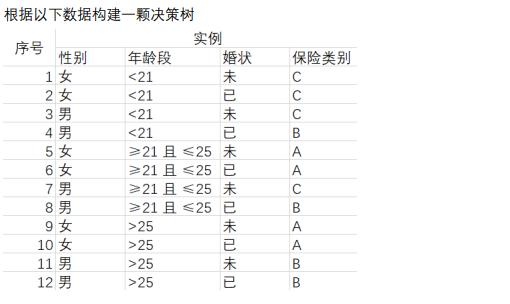
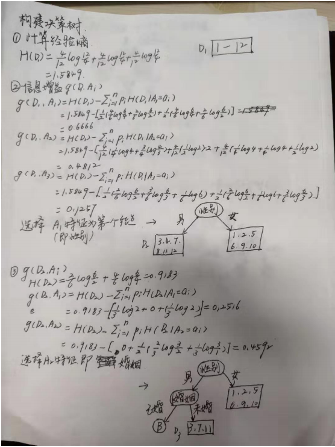
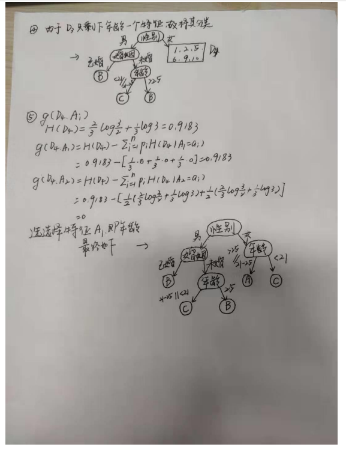
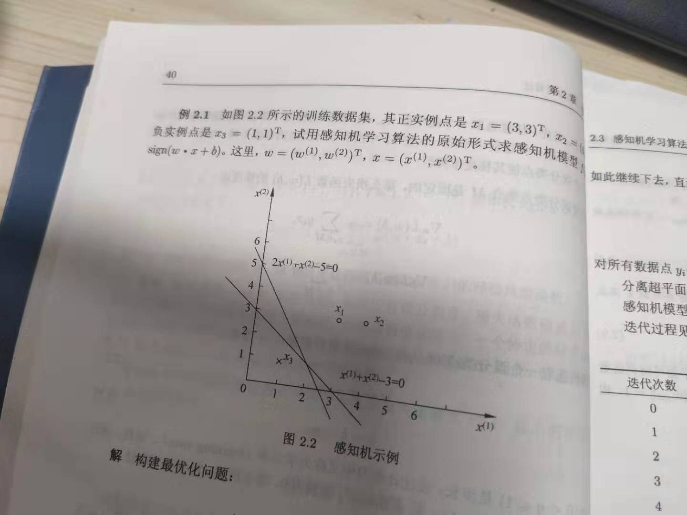
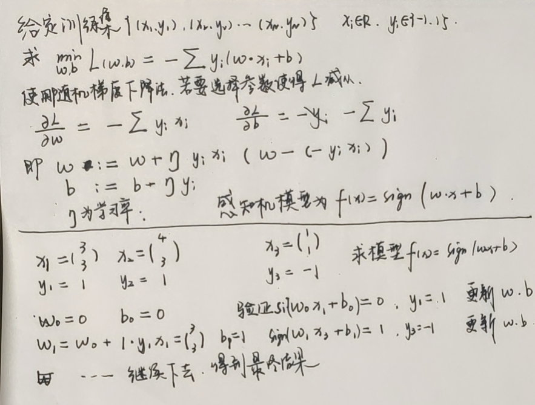
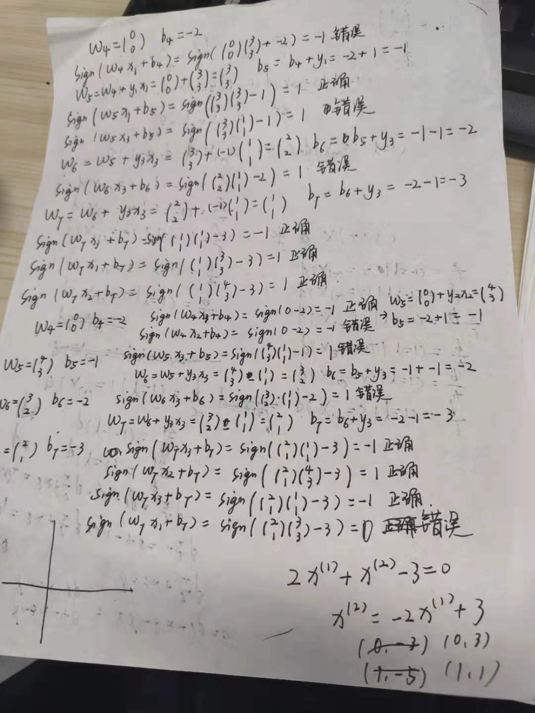
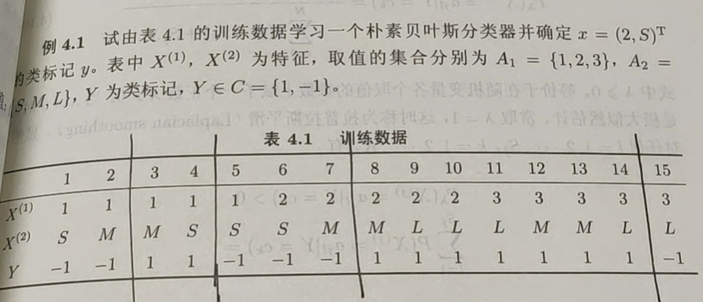
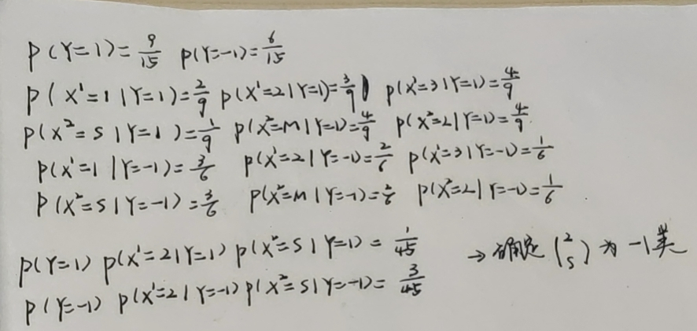

# 19-20秋第13周1125-1201

## 本周工作

*   复习机器学习与统计
*   编程题

## 下周工作

*   复习机器学习与统计
*   编程题
*   Spring


# 复习机器学习与统计

​	看了《统计学习方法》，决策树这一章感觉比较好懂，因为之前也接触过熵这些概念







​	感知机部分则是使用迭代法，每次都减去梯度得到新的值，再进行训练，例题为书上的例2.1



求解的步骤

最后的结果不一定和书上的答案一样，但是通过作图来看，总会将正确的点分类

朴素贝叶斯法利用了条件概率方面的知识，进行了相关复习



# 编程题

14.  最长公共前缀

```python
class Solution:
    def longestCommonPrefix(self, strs: List[str]) -> str:
        res = ""
        for tmp in zip(*strs):
            tmp_set = set(tmp)
            if len(tmp_set) == 1:
                res += tmp[0]
            else:
                break
        return res
```

9.  回文数

```python
class Solution:
    def isPalindrome(self, x: int) -> bool:
        return str(x) == str(x)[::-1]
```

100.  相同的树

```java
public boolean isSameTree(TreeNode p, TreeNode q) {
        if(p == null && q == null){
            return true;
        }
        if(p == null || q == null){
            return false;
        }
        if(p.val != q.val){
            return false;
        }
        return isSameTree(p.left, q.left) && isSameTree(p.right, q.right);
    }
```

20.  有效的括号

```java
public boolean isValid(String s) {
    if(s == null)
        return true;
    Stack<Character> stack = new Stack<>();
    Map<Character, Character> map = new HashMap<>();
    map.put(')','(');
    map.put(']', '[');
    map.put('}', '{');
    for(int i = 0; i < s.length(); i++){
        char temp = s.charAt(i);
        if(map.containsKey(temp)){
            if(stack.size() == 0){
                return false;
             }
            if(stack.pop() != map.get(temp)){
                return false;
            }
        }else{
            stack.add(temp);
        }
    }
    if(stack.size() != 0){
        return false;
    }
    return true;
}
```

268.  缺失的数字

```python
def missingNumber(self, nums: List[int]) -> int:
    sum = 0
    length = len(nums)
    for each in nums:
        sum = sum + each
    return (int)((length * (length + 1)) / 2 - sum )
```

345.  反转字符串中的元音字母

```java
public String reverseVowels(String s) {
        List vowels = new ArrayList();
        StringBuilder stringBuilder = new StringBuilder(s);
        int length = s.length();
        int left = 0;
        int right = length - 1;
        vowels.add('a');
        vowels.add('e');
        vowels.add('i');
        vowels.add('o');
        vowels.add('u');
        vowels.add('A');
        vowels.add('E');
        vowels.add('I');
        vowels.add('O');
        vowels.add('U');
        while(left < right){
            if((vowels.contains(s.charAt(left)) == true) && (vowels.contains(s.charAt(right)) == true)){
                char temp = s.charAt(left);
                stringBuilder.setCharAt(left, s.charAt(right));
                stringBuilder.setCharAt(right, s.charAt(left));
                left++;
                right--;
            }
            else if((vowels.contains(s.charAt(left)) == true) && (vowels.contains(s.charAt(right)) == false)){
                right--;
            }
            else if((vowels.contains(s.charAt(right)) == true) && (vowels.contains(s.charAt(left)) == false)){
                left++;
            }
            else{
                right--;
                left++;
            }
        }
        return stringBuilder.toString();
    }
```

344.  反转字符串

```java
public void reverseString(char[] s) {
        if(s.length < 2 || s == null){
            return;
        }
        int left = 0;
        int right = s.length - 1;
        while(left < right){
            char temp = s[right];
            s[right] = s[left];
            s[left] = temp;
            left++;
            right--;
        }
        return;
    }
```

