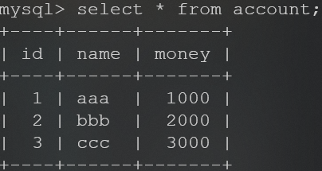

# 19-20秋第12周1118-1124

## 本周工作

*   学习Spring
*   复习机器学习与统计
*   编程题

## 下周工作

*   Spring学习
*   复习机器学习与统计
*   编程题


# Spring学习

## 案例：从零使用spring/c3p0实现前后交互

*   开始构建一个maven工程，编辑pom文件引入spring-context/commons-dbutils/mysql-connector/c3p0/junit

*   交互的数据库是这样的

*   创建对应的实体类`./src/main/java/com/itheima/domain/Account.java`

    ```java
    public class Account {
        private Integer id;
        private String name;
        private Float money;
        /*Getters Setters toString*/
    }
    ```

*   配置service层`./src/main/java/com/itheima/service/IAccountService.java`

    ```java
    public interface IAccountService {
        List<Account> findAllAccount();
        Account findAccountById(Integer accountId);
        void saveAccount(Account account);
        void updateAccount(Account account);
        void deleteAccount(Integer accountId);
    }
    ```

    `./src/main/java/com/itheima/service/impl/AccountService.java`

    ```java
    public class AccountServiceImpl implements IAccountService {
        private IAccountDao accountDao;
        public void setAccountDao(IAccountDao accountDao) {
            this.accountDao = accountDao;
        }
        public List<Account> findAllAccount() {
            return accountDao.findAllAccount();
        }
        public Account findAccountById(Integer accountId) {
            return accountDao.findAccountById(accountId);
        }
        public void saveAccount(Account account) {
            accountDao.saveAccount(account);
        }
        public void updateAccount(Account account) {
            accountDao.updateAccount(account);
        }
        public void deleteAccount(Integer accountId) {
            accountDao.deleteAccount(accountId);
        }
    }
    ```

*   配置dao层`./src/main/java/com/itheima/dao/IAccountDao.java`

    ```java
    public interface IAccountDao {
        List<Account> findAllAccount();
        Account findAccountById(Integer accountId);
        void saveAccount(Account account);
        void updateAccount(Account account);
        void deleteAccount(Integer accountId);
    }
    ```

    `./src/main/java/com/itheima/dao/impl/AccountDaoImpl.java`

    ```java
    public class AccountDaoImpl implements IAccountDao {
        private QueryRunner queryRunner;
        public void setQueryRunner(QueryRunner queryRunner) {
            this.queryRunner = queryRunner;
        }
        public List<Account> findAllAccount() {
            try{
                return queryRunner.query("select * from account",new BeanListHandler<Account>(Account.class));
            }catch (Exception e) {
                throw new RuntimeException(e);
            }
        }
        public Account findAccountById(Integer accountId) {
            try {
                return queryRunner.query("select * from account where id=?", new BeanHandler<Account>(Account.class), accountId);
            } catch (SQLException e) {
                throw new RuntimeException(e);
            }
        }
        public void saveAccount(Account account) {
            try {
                queryRunner.update("insert into account(name, money) values (?, ?)", account.getName(), account.getMoney());
            } catch (SQLException e) {
                throw new RuntimeException(e);
            }
        }
        public void updateAccount(Account account) {
            try {
                queryRunner.update("update account set name=?, money=? where id=?", account.getName(), account.getMoney(), account.getId());
            } catch (SQLException e) {
                throw new RuntimeException(e);
            }
        }
        public void deleteAccount(Integer accountId) {
            try {
                queryRunner.update("delete from account where id=?", accountId);
            } catch (SQLException e) {
                throw new RuntimeException(e);
            }
        }
    }/*/impl/AccountDaoImpl.java*/
    ```

*   配置参数`./src/main/resources/bean.xml`

    ```xml
    <bean id="accountService" class="com.itheima.service.impl.AccountServiceImpl">
            <property name="accountDao" ref="accountDao"></property>
        </bean>
        <bean id="accountDao" class="com.itheima.dao.impl.AccountDaoImpl">
            <property name="queryRunner" ref="queryRunner"></property>
        </bean>
        <bean id="queryRunner" class="org.apache.commons.dbutils.QueryRunner" scope="prototype">
            <constructor-arg name="ds" ref="dataSource"></constructor-arg>
        </bean>
        <bean id="dataSource" class="com.mchange.v2.c3p0.ComboPooledDataSource">
            <property name="driverClass" value="com.mysql.jdbc.Driver"></property>
            <property name="jdbcUrl" value="jdbc:mysql://localhost:3306/test1120"></property>
            <property name="user" value="root"></property>
            <property name="password" value=""></property>
        </bean>
    ```

*   测试类`./src/test/java/com/itheima/AccountServiceTest.java`

    ```java
    public class AccountServiceTest {
        @Test
        public void testFindAllAccount() {
            ApplicationContext ac = new ClassPathXmlApplicationContext("bean.xml");
            IAccountService accountService = ac.getBean("accountService", IAccountService.class);
            List<Account> allAccount = accountService.findAllAccount();
            for(Account each : allAccount){
                System.out.println(each);
            }
        }/*
        Account{id=1, name='aaa', money=1000.0}
    Account{id=2, name='bbb', money=2000.0}
    Account{id=3, name='ccc', money=3000.0}
    Account{id=5, name='Zhang', money=1234.0}*/
        @Test
        public void testFindAccountById() {
            ApplicationContext ac = new ClassPathXmlApplicationContext("bean.xml");
            IAccountService accountService = ac.getBean("accountService", IAccountService.class);
            Account accountById = accountService.findAccountById(5);
            System.out.println(accountById);
        }/*Account{id=5, name='Zhang', money=1234.0}
        */
        @Test
        public void testSaveAccount() {
            ApplicationContext ac = new ClassPathXmlApplicationContext("bean.xml");
            IAccountService accountService = ac.getBean("accountService", IAccountService.class);
            Account account = new Account();
            account.setMoney(1234f);
            account.setName("Zhang");
            accountService.saveAccount(account);
        }/*Account{id=1, name='aaa', money=1000.0}
    Account{id=2, name='bbb', money=2000.0}
    Account{id=3, name='ccc', money=2345.0}
    Account{id=5, name='Zhang', money=1234.0}*/
        @Test
        public void testUpdateAccount() {
            ApplicationContext ac = new ClassPathXmlApplicationContext("bean.xml");
            IAccountService accountService = ac.getBean("accountService", IAccountService.class);
            Account accountById = accountService.findAccountById(4);
            accountById.setMoney(2345f);
            accountService.updateAccount(accountById);
        }/*Account{id=1, name='aaa', money=1000.0}
    Account{id=2, name='bbb', money=2000.0}
    Account{id=3, name='ccc', money=2345.0}
    Account{id=5, name='Zhang', money=1234.0}*/
        @Test
        public void testDeleteAccount() {
            ApplicationContext ac = new ClassPathXmlApplicationContext("bean.xml");
            IAccountService accountService = ac.getBean("accountService", IAccountService.class);
            accountService.deleteAccount(4);
        }/*Account{id=1, name='aaa', money=1000.0}
    Account{id=2, name='bbb', money=2000.0}
    Account{id=3, name='ccc', money=2345.0}*/
    }
    ```

    ### 使用注解实现

    `./src/main/resource/bean_anno.xml`

    ```xml
        <context:component-scan base-package="com.itheima"></context:component-scan>
        <bean id="queryRunner" class="org.apache.commons.dbutils.QueryRunner">
        <constructor-arg name="ds" ref="dataSource"></constructor-arg>
        </bean>
    
        <bean id="dataSource" class="com.mchange.v2.c3p0.ComboPooledDataSource">
            <property name="driverClass" value="com.mysql.jdbc.Driver"></property>
            <property name="jdbcUrl" value="jdbc:mysql://localhost:3306/test1120"></property>
            <property name="user" value="root"></property>
            <property name="password" value=""></property>
        </bean><!--相比于上面的少了accountService和accountDao两个bean的实现-->
    ```

    `./src/main/java/com/itheima/service/impl/AccountServiceImpl.java`

    ```java
    @Service(value = "accountService")//标明是Service的bean对象，名为accountService
    public class AccountServiceImpl implements IAccountService {
        @Autowired
        private AccountDaoImpl accountDao;
    //    由于是autowired自动注入所以不用setter
    //    public void setAccountDao(AccountDao accountDao) {
    //        this.accountDao = accountDao;
    //    }
        public List<Account> selectAll() {
            return accountDao.selectAll();
        }
    }
    ```

    `./src/main/java/com/itheima/dao/impl/AccountDaoImpl.java`

    ```java
    @Repository(value = "accountDao")//标明是repository对象，名为accountDao
    public class AccountDaoImpl implements IAccountDao {
        @Autowired
        private QueryRunner queryRunner ;
    /*由于是autowired自动注入所以不用setter
        public void setQueryRunner(QueryRunner queryRunner) {
            this.queryRunner = queryRunner;
        }
    */
        public List<Account> selectAll() {
            try {
                return queryRunner.query("select * from account", new BeanListHandler<Account>(Account.class));
            } catch (SQLException e) {
                throw new RuntimeException(e);
            }
        }
    }
    ```

    `./src/test/java/com/itheima/TestSpring.java`

    ```java
    public class TestSpring {
        @Test
        public void testSelectAllAnno(){
            ApplicationContext ac = new ClassPathXmlApplicationContext("bean_anno.xml");
            IAccountService accountService = ac.getBean("accountService", IAccountService.class);
            List<Account> accounts = accountService.selectAll();
            for(Account each : accounts){
                System.out.println(each);
            }
        }/*Account{id=1, name='aaa', moneyh=1000.0}
    Account{id=2, name='bbb', moneyh=2000.0}
    Account{id=3, name='ccc', moneyh=2345.0}*/
    }
    ```

    ## 使用新注解

    新建两个类

    `./src/main/java/com/itheima/config/SpringConfiguration.java`

    ```java
    @ComponentScan(basePackages = "com.itheima")
    @Import(JDBCConfiguration.class)
    @PropertySource("classpath:jdbcConfig.properties")
    public class SpringConfiguration {/**/
    }
    ```

    `./src/main/java/com/itheima/config/JDBCCOnfiguration.java`

    ```java
    public class JDBCConfiguration {
        @Value("${jdbc.driver}")
        private String driver;
        @Value("${jdbc.url}")
        private String url;
        @Value("${jdbc.username}")
        private String username;
        @Value("${jdbc.password}")
        private String password;
        @Bean(name = "queryRunner")
        @Scope("prototype")
        public QueryRunner createQueryRunner(DataSource dataSource){
            return new QueryRunner(dataSource);
        }
        @Bean(name = "dataSource")
        public DataSource createDataSource(){
            try{
                ComboPooledDataSource comboPooledDataSource = new ComboPooledDataSource();
                comboPooledDataSource.setDriverClass(driver);
                comboPooledDataSource.setJdbcUrl(url);
                comboPooledDataSource.setUser(username);
                comboPooledDataSource.setPassword(password);
                return comboPooledDataSource;
            } catch (Exception e){
                throw new RuntimeException(e);
            }
        }
    }
    ```

    `./src/main/resources/jdbcConfig.properties`

    ```properties
    jdbc.driver=com.mysql.jdbc.Driver
    jdbc.url=jdbc:mysql://localhost:3306/test1120
    jdbc.username=root
    jdbc.password=
    ```

    还可以使用Spring与JUnit的结合Runner来运行单元测试

    `./src/test/java/com/itheima/TestSpring.java`

    ```java
    @RunWith(SpringJUnit4ClassRunner.class)
    @ContextConfiguration(classes = SpringConfiguration.class)
    public class TestSpring {
        @Autowired
        private IAccountService accountService;//使用了结合的Runner才能确保Autowired注解正常注入
        @Test
        public void testSelectAllAnno(){/*不需要再繁琐的手动读取xml等操作*/
            List<Account> accounts = accountService.selectAll();
            for(Account each : accounts){
                System.out.println(each);
            }
        }/*Account{id=1, name='aaa', moneyh=1000.0}
    Account{id=2, name='bbb', moneyh=2000.0}
    Account{id=3, name='ccc', moneyh=2345.0}*/
    }
    ```

## 转账案例

使用事务回滚应对异常

`./src/main/java/com/itheima/domain/Account.java`

```java
public class Account {
    private Integer id;
    private String name;
    private float money;
    /*Getters Setters toString*/
}
```

`./src/main/java/com/itheima/service/IAccountService.java`

```java
public interface IAccountService {
    List<Account> selectAll();
    Account selectById(Integer id);
    void saveAccount(Account account);
    void updateAccount(Account account);
    void deleteAccount(Integer id);
    Account selectByName(String name);
    void transfer(String transferOutName, String transferInName, float transferAmount);/*转账*/
}
```

`./src/main/java/com/itheima/service/impl/AccountServiceImpl.java`

```java
public class AccountServiceImpl implements IAccountService {

    private IAccountDao iAccountDao;
    private TransactionManager transactionManager;

    public void setTransactionManager(TransactionManager transactionManager) {
        this.transactionManager = transactionManager;
    }

    public void setiAccountDao(IAccountDao iAccountDao) {
        this.iAccountDao = iAccountDao;
    }
    public List<Account> selectAll() {/*...*/}
    public Account selectById(Integer id) {/*...*/}
    public void saveAccount(Account account) {/*...*/}
    public void updateAccount(Account account) {/*...*/}
    public void deleteAccount(Integer id) {/*...*/}
    public Account selectByName(String name) {/*...*/}

    public void transfer(String transferOutName, String transferInName, float transferAmount) {
        try {
            transactionManager.beginTransaction();
            Account transferOuter = iAccountDao.selectByName(transferOutName);
            Account transferIner = iAccountDao.selectByName(transferInName);
            transferOuter.setMoney(transferOuter.getMoney() - transferAmount);
            transferIner.setMoney(transferIner.getMoney() + transferAmount);
            iAccountDao.updateAccount(transferIner);
            int i = 1 / 0;/*设定异常*/
            iAccountDao.updateAccount(transferOuter);
            transactionManager.commit();
        } catch (Exception e) {
            transactionManager.rollback();
            throw new RuntimeException(e);
        } finally {
            transactionManager.release();
        }
    }
}
```

`./src/main/java/com/itheima/dao/IAccountDao.java`

```java
public interface IAccountDao {
    List<Account> selectAll();
    Account selectById(Integer id);
    void saveAccount(Account account);
    void updateAccount(Account account);
    void deleteAccount(Integer id);
    Account selectByName(String name);
}
```

`./src/main/java/com/itheima/dao/impl/AccountDaoImpl.java`

```java
public class AccountDaoImpl implements IAccountDao {
    private QueryRunner queryRunner;
    private ConnectionUtils connectionUtils;
    public void setConnectionUtils(ConnectionUtils connectionUtils) {
        this.connectionUtils = connectionUtils;
    }
    public void setQueryRunner(QueryRunner queryRunner) {
        this.queryRunner = queryRunner;
    }
    public List<Account> selectAll() {
        try {
            return queryRunner.query(connectionUtils.getThreadConnection(), "select * from account", new BeanListHandler<Account>(Account.class));
        } catch (SQLException e) {
            throw new RuntimeException(e);
        }
    }
    public Account selectById(Integer id) {
        try {
            return queryRunner.query(connectionUtils.getThreadConnection(), "select * from account where id=?", new BeanHandler<Account>(Account.class), id);
        } catch (SQLException e) {
            throw new RuntimeException(e);
        }
    }
    public void saveAccount(Account account) {
        try {
            queryRunner.update(connectionUtils.getThreadConnection(), "insert into account(name, money) values (?, ?)", account.getName(), account.getMoney());

        } catch (SQLException e) {
            throw new RuntimeException(e);
        }
    }
    public void updateAccount(Account account) {
        try {
            queryRunner.update(connectionUtils.getThreadConnection(), "update account set name=?, money=? where id=?", account.getName(), account.getMoney(), account.getId());
        } catch (SQLException e) {
            throw new RuntimeException(e);
        }
    }
    public void deleteAccount(Integer id) {
        try {
            queryRunner.update(connectionUtils.getThreadConnection(), "delete from account where id=?", id);
        } catch (SQLException e) {
            throw new RuntimeException(e);
        }
    }
    public Account selectByName(String name) {
        try {
            Account account = queryRunner.query(connectionUtils.getThreadConnection(),"select * from account where name=?", new BeanHandler<Account>(Account.class), name);
            return account;
        } catch (SQLException e) {
            throw new RuntimeException(e);
        }
    }
}
```

`./src/main/java/com/itheima/utils/ConnectionUtils.java`

```java
public class ConnectionUtils {
    private ThreadLocal<Connection> tl = new ThreadLocal<Connection>();
    private DataSource dataSource;
    public void setDataSource(DataSource dataSource) {
        this.dataSource = dataSource;
    }
    public Connection getThreadConnection(){
        try {
            Connection connection = tl.get();
            if(connection == null){
                connection = dataSource.getConnection();
                tl.set(connection);
            }
            return connection;
        } catch (Exception e){
            throw new RuntimeException(e);
        }
    }
    public void removeConnection(){
        tl.remove();
    }
}
```

`./src/main/java/com/itheima/utils/TransactionManager.java`

```java
public class TransactionManager {
    private ConnectionUtils connectionUtils;
    public void setConnectionUtils(ConnectionUtils connectionUtils) {
        this.connectionUtils = connectionUtils;
    }
    public void beginTransaction(){
        try {
            connectionUtils.getThreadConnection().setAutoCommit(false);
        } catch (SQLException e) {
            e.printStackTrace();
        }
    }
    public void commit(){
        try {
            connectionUtils.getThreadConnection().commit();
        } catch (SQLException e) {
            e.printStackTrace();
        }
    }
    public void rollback(){
        try {
            connectionUtils.getThreadConnection().rollback();
        } catch (SQLException e) {
            e.printStackTrace();
        }
    }
    public void release(){
        try {
            connectionUtils.getThreadConnection().close();
            connectionUtils.removeConnection();
        } catch (SQLException e) {
            e.printStackTrace();
        }
    }
}
```

`./src/main/resources/Beans.xml`

```xml
<?xml version="1.0" encoding="UTF-8"?>
<beans xmlns="http://www.springframework.org/schema/beans"
       xmlns:xsi="http://www.w3.org/2001/XMLSchema-instance"
       xsi:schemaLocation="http://www.springframework.org/schema/beans
        http://www.springframework.org/schema/beans/spring-beans.xsd">
    <bean id="accountService" class="com.itheima.service.impl.AccountServiceImpl">
        <property name="iAccountDao" ref="accountDao"></property>
        <property name="transactionManager" ref="transactionManager"></property>
    </bean>
    <bean id="accountDao" class="com.itheima.dao.impl.AccountDaoImpl">
        <property name="queryRunner" ref="queryRunner"></property>
        <property name="connectionUtils" ref="connectionUtils"></property>
    </bean>
    <bean id="queryRunner" class="org.apache.commons.dbutils.QueryRunner">
        <constructor-arg name="ds" ref="dataSource"></constructor-arg>
    </bean>
    <bean id="dataSource" class="com.mchange.v2.c3p0.ComboPooledDataSource">
        <property name="driverClass" value="com.mysql.jdbc.Driver"></property>
        <property name="jdbcUrl" value="jdbc:mysql://localhost:3306/test1120"></property>
        <property name="user" value="root"></property>
        <property name="password" value=""></property>
    </bean>
    <bean id="connectionUtils" class="com.itheima.utils.ConnectionUtils">
        <property name="dataSource" ref="dataSource"></property>
    </bean>
    <bean id="transactionManager" class="com.itheima.utils.TransactionManager">
        <property name="connectionUtils" ref="connectionUtils"></property>
    </bean>
</beans>
```

./src/test/java/com/itheima/TestSpring.java

```java
@RunWith(SpringJUnit4ClassRunner.class)
@ContextConfiguration(locations = "classpath:Beans.xml")
public class TestSpring {
    @Autowired
    private IAccountService iAccountService = null;
	@Test
    public void testSelectAll(){
        List<Account> accounts = iAccountService.selectAll();
        for(Account each : accounts){
            System.out.println(each);
        }
    }
    @Test
    public void testTransfer(){
        System.out.println("************************转账前****************************");
        testSelectAll();
        System.out.println("*********************************************************");
        iAccountService.transfer("aaa", "bbb", 10.0f);
        System.out.println("************************转账后****************************");
        testSelectAll();
        System.out.println("*********************************************************");
    }
}
/*结果为
************************转账前****************************
Account{id=1, name='aaa', money=960.0}
Account{id=2, name='bbb', money=990.0}
Account{id=3, name='ccc', money=2345.0}
*********************************************************
java.lang.RuntimeException: java.lang.ArithmeticException: / by zero
Process finished with exit code -1

再次查询数据库发现为
Account{id=1, name='aaa', money=960.0}
Account{id=2, name='bbb', money=990.0}
Account{id=3, name='ccc', money=2345.0}
与之前结果一致，说明使用了事务，当出现异常时回滚*/
```

# 编程题

## 445. 两数相加 II

```java
class Solution {
    public ListNode addTwoNumbers(ListNode l1, ListNode l2) {
        Stack<Integer> stack1 = buildStack(l1);
        Stack<Integer> stack2 = buildStack(l2);//分别将两个链表建栈
        int carry = 0;//声明进位
        ListNode head = new ListNode(-1);//头节点，等会要使用头插法
        while(!stack1.isEmpty() || !stack2.isEmpty() || carry != 0){//任何一个栈不为空或进位不为0时
            int x = stack1.isEmpty()? 0 : stack1.pop();
            int y = stack2.isEmpty()? 0 : stack2.pop();
            int sum = x + y + carry;//将两个栈的数字相加，别忘了还有进位
            ListNode temp = new ListNode(sum % 10);//其中，取10的余数新建一个要插入的节点
            carry = sum / 10;//与10的倍数表示进位数
            temp.next = head.next;
            head.next = temp;//使用头插法
        }
        return head.next;//去掉头节点后返回
    }
    private Stack<Integer> buildStack(ListNode ln){//自定义函数用来根据链表建立数栈，其中，高位在栈底，地位在栈顶，所以出栈的时候先出低位，这和加法的过程保持一致，先进行低位运算
        Stack<Integer> stack = new Stack<Integer>();
        while(ln != null){
            stack.push(ln.val);
            ln = ln.next;
        }
        return stack;
    }
}
```

## 328. 奇偶链表

```java
class Solution {
    public ListNode oddEvenList(ListNode head) {
        if(head == null){
            return null;
        }
        ListNode odd = head;
        ListNode even = head.next;
        ListNode evenHead = even;
        while(even != null && even.next != null){
            odd.next = odd.next.next;
            odd = odd.next;
            even.next = even.next.next;
            even = even.next;
        }
        odd.next = evenHead;
        return head;
    }
}
```

