# JSP\Maven\MyBatis学习,以及一些案例

## Cookie

* ```java
    @WebServlet(name = "Test1", urlPatterns = "/Test1")
    public class Test1 extends HttpServlet {
        protected void doPost(HttpServletRequest request, HttpServletResponse response) throws ServletException, IOException {
            Cookie cookie = new Cookie("cookie", "testCookie");
            response.addCookie(cookie);
            response.addCookie(new Cookie("hello", "你好"));
        }
        protected void doGet(HttpServletRequest request, HttpServletResponse response) throws ServletException, IOException {
            this.doPost(request, response);
        }
    }//设置了两个Cookie
    ```

    ```java
    @WebServlet(name = "Test2", urlPatterns = "/Test2")
    public class Test2 extends HttpServlet {
        protected void doPost(HttpServletRequest request, HttpServletResponse response) throws ServletException, IOException {
            System.out.println("*******************************************************************");
            Cookie[] cookies = request.getCookies();
            for (Cookie each : cookies) {
                System.out.println(each.getName() + "=" + each.getValue());
            }
        }
        protected void doGet(HttpServletRequest request, HttpServletResponse response) throws ServletException, IOException {
            this.doPost(request, response);
        }
    }//在另外一个页面中提取Cookie的键值对并输出
    ```

* 先访问`localhost:8080/TestCookie/Test1`再访问`localhost:8080/TestCookie/Test2`

* 结果为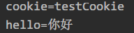

## 持久化

* 默认情况下，关闭浏览器Cookie即会被删除

    * 还是上面两个`Servlet`
    * 先访问`localhost:8080/TestCookie/Test1`，再关闭浏览器，再访问`localhost:8080/TestCookie/Test2`
    * 控制台中没有上面的Cookie

* 修改Test1.java

    ```java
    @WebServlet(name = "Test1", urlPatterns = "/Test1")
    public class Test1 extends HttpServlet {
        protected void doPost(HttpServletRequest request, HttpServletResponse response) throws ServletException, IOException {
            System.out.println("Hello");
            Cookie cookie = new Cookie("cookie", "testCookie");
            cookie.setMaxAge(20);//设置持续时间
            response.addCookie(cookie);
            response.addCookie(new Cookie("hello", "你好"));
        }
        protected void doGet(HttpServletRequest request, HttpServletResponse response) throws ServletException, IOException {
            this.doPost(request, response);
        }
    }
    ```

* 还是刚才的操作，先访问`localhost:8080/TestCookie/Test1`，再访问`localhost:8080/TestCookie/Test2`，控制台输出为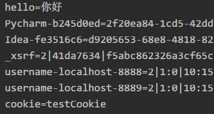

* 等待20秒后刷新`localhost:8080/TestCookie/Test2`，输出为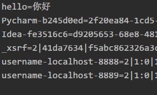

* 可以发现，`cookie=testCookie`消失，原因是我们设置了20秒后自动删除，而没有设置自动删除的`cookie`被保留下来，当然如果关闭了浏览器，它也会被删除

* 如果设置`cookie.setMaxAge()`参数为一个很大的值，那么它将会被长时间保留，即使关闭了浏览器也是如此，将其设置为`10000`

* 访问Test1后关闭浏览器再访问Test2，输出为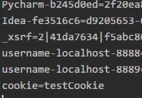

* 说明这个`Cookie`被持续存储了

## 共享

* 实现两个项目共享一个`Cookie`，为此在IDEA中新建一个`Module`

* ```java
    @WebServlet(name = "Test1", urlPatterns = "/Test1")
    public class Test1 extends HttpServlet {
        protected void doPost(HttpServletRequest request, HttpServletResponse response) throws ServletException, IOException {
            System.out.println("Hello");
            Cookie cookie = new Cookie("cookie", "testCookie");
            cookie.setPath("/");//设置cookie路径为根目录，若不设置则在新项目中就get不到cookie
            response.addCookie(cookie);
            response.addCookie(new Cookie("hello", "你好"));
        }
        protected void doGet(HttpServletRequest request, HttpServletResponse response) throws ServletException, IOException {
            this.doPost(request, response);
        }
    }
    ```

    ```java
    @WebServlet(name = "Test2", urlPatterns = "/Test2")
    public class Test2 extends HttpServlet {
        protected void doPost(HttpServletRequest request, HttpServletResponse response) throws ServletException, IOException {
            System.out.println("*******************************************************************");
            Cookie[] cookies = request.getCookies();
            for (Cookie each : cookies) {
                System.out.println(each.getName() + "=" + each.getValue());
            }
        }
        protected void doGet(HttpServletRequest request, HttpServletResponse response) throws ServletException, IOException {
            this.doPost(request, response);
        }
    }
    ```

    ```java
    @WebServlet(name = "TestCookie", urlPatterns = "/TestCookie")
    public class TestCookie extends HttpServlet {
        protected void doPost(HttpServletRequest request, HttpServletResponse response) throws ServletException, IOException {
            System.out.println("TestCookie");
            Cookie[] cookies = request.getCookies();
            for (Cookie each : cookies) {
                System.out.println(each.getName() + "=" + each.getValue());
            }
        }
        protected void doGet(HttpServletRequest request, HttpServletResponse response) throws ServletException, IOException {
            this.doPost(request, response);
        }
    }//新项目下获取cookie
    ```

* 先访问`Test1`，再访问`Test2`，再访问`TestCookie`

* 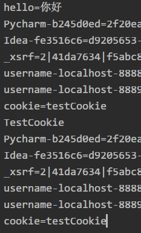

* 成功地实现了在不同项目中共享`Cookie`

## 案例

首次访问页面时显示`欢迎首次`，第二次则显示`欢迎回来`，使用cookies作为标记来确定是否为第一次访问

* ```java
    @WebServlet(name = "LastTime", urlPatterns = "/LastTime")//http://localhost:8080/TestCookie/LastTime
    public class LastTime extends HttpServlet {
        protected void doPost(HttpServletRequest request, HttpServletResponse response) throws ServletException, IOException {
            response.setContentType("text/html;charset=utf-8");
            Cookie[] cookies = request.getCookies();
            boolean flag = false;
            if (cookies != null && cookies.length > 0){//若存在cookie且长度大于0时，应该显示再次访问页面
                for (Cookie each : cookies){
                    String name = each.getName();
                    if("lasttime".equals(name)){
                        flag = true;//设置标志位
                        Date date = new Date();
                        SimpleDateFormat simpleDateFormat = new SimpleDateFormat("yyyy-mm-dd hh:mm:ss");
                        String sdate = simpleDateFormat.format(date);//格式化时间日期
                        sdate = URLEncoder.encode(sdate, "utf-8");//使用utf转码传输，否则会报错
                        each.setValue(sdate);//设置键值
                        each.setMaxAge(10);//10秒便于测试
                        response.addCookie(each);//加入cookie
                        String value = each.getValue();
                        value = URLDecoder.decode(value, "utf-8");//解码输出时间
                        response.getWriter().write("<h1>欢迎回来,上次的访问时间是</h1>" + value);
                    }
                }
            }
            if (cookies == null || cookies.length == 0 || !flag){//若不存在cookie或者flag标志位显示未访问过时，这个时候应该显示首次访问页面
                Date date = new Date();
                SimpleDateFormat simpleDateFormat = new SimpleDateFormat("yyyy mm dd hh:mm:ss");
                String sdate = simpleDateFormat.format(date);
                sdate = URLEncoder.encode(sdate, "utf-8");
                Cookie lasttime = new Cookie("lasttime", sdate);
                lasttime.setMaxAge(10);//10秒便于测试
                response.addCookie(lasttime);
                response.getWriter().write("<h1>欢迎首次访问</h1>");
            }
        }
        protected void doGet(HttpServletRequest request, HttpServletResponse response) throws ServletException, IOException {
            this.doPost(request, response);
        }
    }
    ```

* 第一次进入`localhost:8080/TestCookie/LastTime`时，显示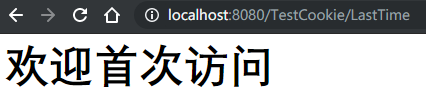

* 刷新一下则显示

## Session

*一次开关浏览器即是一个Session*

* ```java
    @WebServlet(name = "TestSession", urlPatterns = "/TestSession")//http://localhost:8080/TestCookie/TestSession
    public class TestSession extends HttpServlet {
        protected void doPost(HttpServletRequest request, HttpServletResponse response) throws ServletException, IOException {
            HttpSession session = request.getSession();
            session.setAttribute("session", "test");
            System.out.println("/TestSession:session=test");
        }
        protected void doGet(HttpServletRequest request, HttpServletResponse response) throws ServletException, IOException {
            this.doPost(request, response);
        }
    }
    ```

    ```java
    @WebServlet(name = "TestSession2", urlPatterns = "/TestSession2")//http://localhost:8080/TestCookie/TestSession2
    public class TestSession2 extends HttpServlet {
        protected void doPost(HttpServletRequest request, HttpServletResponse response) throws ServletException, IOException {
            HttpSession session = request.getSession();
            System.out.print("/TestSession2:session=");
            System.out.println(session.getAttribute("session"));
        }
        protected void doGet(HttpServletRequest request, HttpServletResponse response) throws ServletException, IOException {
            this.doPost(request, response);
        }
    }
    ```

* 先访问`localhost:8080/TestCookie/TestSession`再访问`localhost:8080/TestCookie/TestSession2`，结果为

* 重启浏览器再访问`localhost:8080/TestCookie/TestSession2`，结果为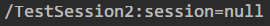

* 观察两次访问网页的`RequestHeaders`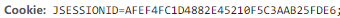和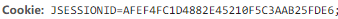发现是一样的

* `Session`实现依赖于`Cookie`，设置`Session`参数时也新生成了`Cookie`的`id`，而`Session`设置的参数被存储在服务器中，一旦会话结束，随着`Cookie`的删除，`Session`也被删除了

* 客户端关闭，服务器不关闭，则两次获取的Session默认不是一个Session，但是可以实现让他们相同

* 客户端不关闭，服务器关闭，两次获取的`Session`一般不是一个`Session`，先访问`localhost:8080/TestCookie/TestSession3`，控制台输出`org.apache.catalina.session.StandardSessionFacade@7395d3cf`，重启服务器后再访问输出`org.apache.catalina.session.StandardSessionFacade@5891c82b`，即使没有关闭浏览器，两次`Session`的`id`还是不一样

## JSP

* 新建`index.jsp`

    ```jsp
    <%@ page contentType="text/html;charset=UTF-8" language="java" %>
    <html>
      <head>
        <title>$Title$</title>
      </head>
      <body>
      $END$
      <%
        System.out.println("Hello");
      %>
      <h1>Hello</h1>
      </body>
    </html>
    ```

* 部署服务器后访问`localhost:8080/TestCookie/`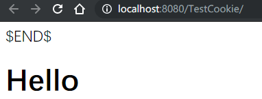

* 与此同时控制台输出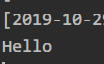

## 错误页

* 有时访问网页错误时并不想看到报错信息，这时候需要定义`errorPage`属性

* ```jsp
    <%@ page contentType="text/html;charset=UTF-8" language="java" errorPage="ErrorPage.jsp" <%--设置错误页跳转至相应的页面--%>%>
    <html>
      <head>
        <title>$Title$</title>
      </head>
      <body>
      $END$
      <%
        System.out.println("Hello");
        int i = 1 / 0;<%--错误的代码块--%>
      %>
      <h1>Hello</h1>
      </body>
    </html>
    ```

* 同时编写一个`ErrorPage.jsp`文件

    ```jsp
    <%@ page contentType="text/html;charset=UTF-8" isErrorPage="true" language="java" %><%--isErrorPage标记是否为错误页，true时exception对象就可用了--%>
    <html>
    <head>
        <title>错误页面</title>
    </head>
    <body>
        <h1>服务器发生错误</h1>
        <%
            System.out.println(exception.getMessage());//这句话必须在isErrorPage为true时才可用
        %>
    </body>
    </html>
    ```

* 启动服务器访问`localhost:8080/TestCookie/`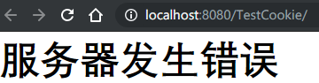

* 控制台输出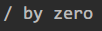

## EL表达式

用于在`jsp`页面中内嵌代码

* ```jsp
    <%@ page contentType="text/html;charset=UTF-8" language="java" %>
    <html>
        <head>
            <title>TestEL</title>
        </head>
        <body>
            ${1 == 1}
            \${1 == 1}<%--美元加大括号括起来的可执行的一段代码，也可以使用转义字符--%>
            
            <h3>获取User</h3><%--类的存取--%>
            <%
                User user = new User("zhang", 18);
            /*
            	已经定义了User对象，
            	public class User {
        			private String name;
        			private int age;
        			**Getters and Setters**
        			//这种好像也被称为一个JavaBean
        		}
            */
                request.setAttribute("user", user);//将这个数据存储
            %>
            ${requestScope.user.toString()}<br>
            
            <h3>ArrayList</h3><%--ArrayList类型的存取--%>
            <%
                ArrayList<Integer> ints;
                ints = new ArrayList<Integer>();
                ints.add(1);
                ints.add(2);
                ints.add(3);
                request.setAttribute("ints", ints);
            %>
            ${requestScope.ints[0]}
            ${requestScope.ints[1]}
            ${requestScope.ints[2]}<br>
            
            <h3>HashMap</h3><%--HashMap类型的存取--%>
            <%
                HashMap hashMap = new HashMap();
                hashMap.put("name", "li");
                hashMap.put("age", 11);
                request.setAttribute("hashMap", hashMap);
            %>
            ${requestScope.hashMap.name}
            ${requestScope.hashMap["age"]}
            
            <h3>empty运算符</h3><%--empty运算符--%>
            <%
                String string1 = "test";
                String string2 = null;
                request.setAttribute("string1", string1);
                request.setAttribute("string2", string2);
            %>
            ${requestScope.string1}
            ${requestScope.string2}<br>
            ${empty string1}
            ${empty string2}
            
            <h3>pageContext</h3><%--内置对象pageContext--%>
            ${pageContext.request.contextPath}<br>
        </body>
    </html>
    ```

* 访问结果为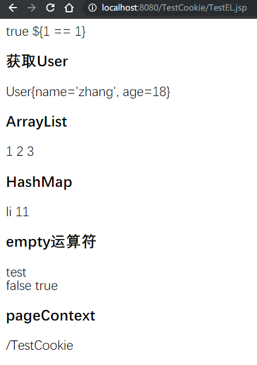

* 可以看到EL主要是为了嵌入代码

## 用户查询案例

*   Servlet + JSP + MySQL + JDBCTemplate + Druid + BeanUtils + Tomcat
*   Web层、Service层、Dao层的架构协作

## 建立数据库

```sql
use test; 			 -- 使用数据库
create table user(   -- 创建表
	id int primary key auto_increment,
	name varchar(20) not null,
	gender varchar(5),
	age int,
	address varchar(32),
	qq	varchar(20),
    email varchar(50)
	);
```

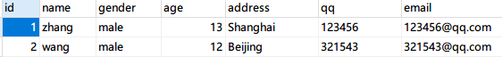

## 内容

```
.//项目结构 
├─lib//各种包的文件夹
│      c3p0-0.9.1.2.jar
│      commons-beanutils-1.8.3.jar
│      commons-logging-1.1.1.jar
│      druid-1.0.9.jar
│      javax.servlet.jsp.jstl.jar
│      jstl-impl.jar
│      mysql-connector-java-5.1.18-bin.jar
│      spring-beans-4.2.4.RELEASE.jar
│      spring-core-4.2.4.RELEASE.jar
│      spring-jdbc-4.2.4.RELEASE.jar
│      spring-tx-4.2.4.RELEASE.jar
│      
├─src//资源目录
│  │  druid.properties//连接池配置文件
│  │  
│  └─UserCase
│      ├─dao//数据库交互模块
│      │      UserDao.java
│      │      UserDaoImpl.java
│      │      
│      ├─domain//数据对象模块
│      │      User.java
│      │      
│      ├─service//控制模块
│      │      UserService.java
│      │      UserServiceImpl.java
│      │      
│      ├─util//快速连接模块
│      │      JDBCUtils.java
│      │      
│      └─web//页面模块
│          └─servlet
│                  UserListServlet.java
│                  
└─web//显示页面
    │  index.jsp
    │  listall.jsp
```

```
//druid.properties 数据库连接配置文件
driverClassName=com.mysql.jdbc.Driver
url=jdbc:mysql:///test
username=root
password=
# 初始化连接数量
initialSize=5
# 最大连接数
maxActive=10
# 最大等待时间
maxWait=3000
```

```java
public class JDBCUtils {//快速连接模块
    private static DataSource ds ;
    static {
        try {
            Properties pro = new Properties();
            InputStream is = JDBCUtils.class.getClassLoader().getResourceAsStream("druid.properties");
            pro.load(is);
            ds = DruidDataSourceFactory.createDataSource(pro);
        } catch (IOException e) {
            e.printStackTrace();
        } catch (Exception e) {
            e.printStackTrace();
        }
    }
    public static DataSource getDataSource(){
        return ds;
    }
    public static Connection getConnection() throws SQLException {
        return  ds.getConnection();
    }
}
```

```java
public class User {
    private int id;
    private String name;
    private String gender;
    private int age;
    private String address;
    private String qq;
    private String email;
    /*Getters Setters and toString*/
}
```

```java
public interface UserDao {//数据库交互接口
    public List<User> findall();
}
```

```java
public class UserDaoImpl implements UserDao {//实现数据库交互接口
    private JdbcTemplate template = new JdbcTemplate(JDBCUtils.getDataSource());
    @Override
    public List<User> findall() {
        String sql = "Select * from user";
        List<User> users = template.query(sql, new BeanPropertyRowMapper<User>(User.class));
        return users;
    }
}
```

```java
public interface UserService {//控制模块接口
    public List<User> findAll();
}
```

```java
public class UserServiceImpl implements UserService {//实现控制模块接口
    private UserDao userDao = new UserDaoImpl();
    public List<User> findAll() {
        return userDao.findall();
    }
}
```

```java
@WebServlet(name = "UserListServlet", urlPatterns = "/UserListServlet")//页面的Servlet
public class UserListServlet extends HttpServlet {
    protected void doPost(HttpServletRequest request, HttpServletResponse response) throws ServletException, IOException {
        UserServiceImpl userService = new UserServiceImpl();
        List<User> users = userService.findAll();
        request.setAttribute("Users", users);
        for (User each : users) {
            System.out.println(each);
        }
        request.getRequestDispatcher("/listall.jsp").forward(request, response);
    }
    protected void doGet(HttpServletRequest request, HttpServletResponse response) throws ServletException, IOException {
        doPost(request, response);
    }
}
```

```jsp
<%@ page contentType="text/html;charset=UTF-8" language="java" %><%--输出网页--%>
<%@taglib prefix="c" uri="http://java.sun.com/jsp/jstl/core" %>
<html>
<head>
    <title>Title</title>
</head>
<body>
<c:forEach items="${Users}" var="user" varStatus="s">
    <tr>
        <td>${s.count}</td>
        <td>${user.name}</td>
        <td>${user.gender}</td>
        <td>${user.age}</td>
        <td>${user.address}</td>
        <td>${user.qq}</td>
        <td>${user.email}</td>
        <br>
    </tr>
</c:forEach>
</body>
</html>
```

## 结果

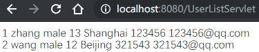

## Maven

方便地管理各种包

*   安装`Maven`只要解压到文件夹即可,同时换源确保速度

*   在`IDEA`中创建`Maven`工程,选择相应的配置文件和仓库

*   找到`pom.xml`文件,在里面编辑要用的包,后台就会自动下载,导入好需要的包

    ```xml
    <dependencies>
        <dependency>
          <groupId>junit</groupId>
          <artifactId>junit</artifactId>
          <version>4.11</version>
          <scope>test</scope>
        </dependency>
        <dependency>
          <groupId>javax.servlet</groupId>
          <artifactId>servlet-api</artifactId>
          <version>2.5</version>
        </dependency>
        <dependency>
          <groupId>org.mybatis</groupId>
          <artifactId>mybatis</artifactId>
          <version>3.4.5</version>
        </dependency>
        <dependency>
          <groupId>mysql</groupId>
          <artifactId>mysql-connector-java</artifactId>
          <version>5.1.32</version>
        </dependency>
        <dependency>
          <groupId>log4j</groupId>
          <artifactId>log4j</artifactId>
          <version>1.2.17</version>
        </dependency>
        <dependency>
          <groupId>junit</groupId>
          <artifactId>junit</artifactId>
          <version>4.12</version>
        </dependency>
      </dependencies>
    ```

*   要测试`Servlet`工程,还需配置`Tomcat`安装的路径

*   需要注意的是,这次的`URL`不能用注解配置了,需要用传统的`web.xml`文件配置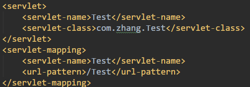

*   ```java
    public class Test extends HttpServlet {//Servlet文件内容
        @Override
        protected void service(HttpServletRequest req, HttpServletResponse resp) throws ServletException, IOException {
            req.setCharacterEncoding("utf-8");
            System.out.println("req.setCharacterEncoding(\"utf-8\")");
        }
    }
    ```

*   开启服务器,访问``localhost:8080/maven_webapp_Web_exploded/Test`,控制台输出`req.setCharacterEncoding("utf-8")`

*   测试mysql交互功能,需要先建好表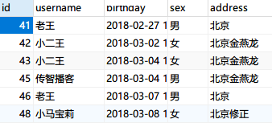

*   在`./src/main/resource/`下新建一个`SqlMapConfig.xml`文件

    ```xml
    <?xml version="1.0" encoding="UTF-8"?>
    <!DOCTYPE configuration
            PUBLIC "-//mybatis.org//DTD Config 3.0//EN"
            "http://mybatis.org/dtd/mybatis-3-config.dtd">
    <configuration>
        <environments default="mysql">
            <environment id="mysql"><!--设定mysql的各项参数-->
                <transactionManager type="jdbc"></transactionManager>
                <dataSource type="POOLED"><!---->
                    <property name="driver" value="com.mysql.jdbc.Driver"/>
                    <property name="url" value="jdbc:mysql://localhost:3306/test"/>
                    <property name="username" value="root"/>
                    <property name="password" value=""/>
                </dataSource>
            </environment>
        </environments>
        <mappers>
            <mapper class="com.zhang.dao.UserDao"></mapper><!--指定要映射的接口-->
        </mappers>
    </configuration>
    ```

*   同时在`./src/main/java/dao/`下新建`UserDao`接口

    ```java
    public interface UserDao {
        @Select("select * from user")
        List<User> findAll();
    }
    ```

*   `./src/main/java/domain/`下新建`User`类

    ```java
    public class User implements Serializable {
        private Integer id;
        private String username;
        private Date birthday;
        private String gender;
        private String address;
        /*Getters Setters toString*/
    }
    ```

*   `./src/main/java/test/`下新建`TestMyBatis`类

    ```java
    public class TestMybatis {
        public static void main(String[] args) throws IOException {
            InputStream resourceAsStream = Resources.getResourceAsStream("SqlMapConfig.xml");//读取配置文件
            SqlSessionFactoryBuilder sqlSessionFactoryBuilder = new SqlSessionFactoryBuilder();
            SqlSessionFactory build = sqlSessionFactoryBuilder.build(resourceAsStream);//创建SqlSession工厂
            SqlSession sqlSession = build.openSession();//生产sqlSession对象
            UserDao mapper = sqlSession.getMapper(UserDao.class);//创建dao对象
            List<User> all = mapper.findAll();//执行方法
            for(User each : all){
                System.out.println(each);
            }//输出
            sqlSession.close();
            resourceAsStream.close();//关闭Session和配置文件读取
        }
    }
    ```

*   运行结果

## Kaggle上的练习项目Titanic

文档目前在寝室的电脑上未同步,下周与基础知识一起做一个汇总吧

## 编程题

## 21. 合并两个有序链表

```java
/*
    将两个有序链表合并为一个新的有序链表并返回
    新链表是通过拼接给定的两个链表的所有节点组成的
    输入：1->2->4, 1->3->4
    输出：1->1->2->3->4->4
*/
public ListNode mergeTwoLists(ListNode l1, ListNode l2) {
        if(l1 == null)
            return l2;
        if(l2 == null)
            return l1;
        if(l1.val <= l2.val){
            l1.next = mergeTwoLists(l1.next, l2);
            return l1;
        }else{
            l2.next = mergeTwoLists(l2.next, l1);
            return l2;
        }
    }
```

## 83. 删除排序链表中的重复元素

```java
/*
	给定一个排序链表，删除所有重复的元素，使得每个元素只出现一次
    输入: 1->1->2->3->3
    输出: 1->2->3
*/
class Solution {
    public ListNode deleteDuplicates(ListNode head) {
        ListNode cur = head;
        while(cur != null && cur.next != null){
            if(cur.val == cur.next.val){
                cur.next = cur.next.next;
            }
            else{
                cur = cur.next;
            }
        }
        return head;
    }
}
```

## 19. 删除链表的倒数第N个节点

```java
/*
	给定一个链表，删除链表的倒数第n个节点，并且返回链表的头结点
	给定一个链表: 1->2->3->4->5, 和 n = 2
	当删除了倒数第二个节点后，链表变为 1->2->3->5
*/
class Solution {
    public ListNode removeNthFromEnd(ListNode head, int n) {
        if(n == 0){
            return head;
        }
        ListNode slow = head;
        ListNode fast = head;
        while(n > 0){
            fast = fast.next;
            n--;
        }
        if(fast == null){
            return head.next;
        }
        while(fast.next != null){
            fast = fast.next;
            slow = slow.next;
        }
        slow.next = slow.next.next;
        return head;
    }
}
```

## 24. 两两交换链表中的节点

```java
/*
给定一个链表，两两交换其中相邻的节点，并返回交换后的链表
不能只是单纯的改变节点内部的值，而是需要实际的进行节点交换
给定 1->2->3->4, 你应该返回 2->1->4->3
*/
class Solution {
    public ListNode swapPairs(ListNode head) {
        ListNode pre = new ListNode(-1);
        pre.next = head;
        ListNode temp = pre;
        while((temp.next != null ) && (temp.next.next != null)){
            ListNode start = temp.next;
            ListNode end = temp.next.next;
            temp.next = end;
            start.next = end.next;
            end.next = start;
            temp = start;
        }
        return pre.next;
    }
}
```

## 144. 二叉树的前序遍历

```java
class Solution {
    public List<Integer> preorderTraversal(TreeNode root) {
        List<Integer> list = new ArrayList<>();
        if(root == null)
            return list;
        Stack<TreeNode> stack = new Stack<>();
        stack.push(root);
        while(!stack.isEmpty()){
            TreeNode temp = stack.pop();
            list.add(temp.val);
            if(temp.right != null){
                stack.push(temp.right);
            }
            if(temp.left != null){
                stack.push(temp.left);
            }
        }
        return list;
    }
}//生成nlr
```

## 94. 二叉树的中序遍历

```java
class Solution {
    public List<Integer> inorderTraversal(TreeNode root) {
        List<Integer> list = new ArrayList<>();
        if(root == null)
            return list;
        Stack<TreeNode> stack = new Stack<>();
        TreeNode temp = root;
        while(temp != null || !stack.isEmpty()){
            while(temp != null){
                stack.push(temp);
                temp = temp.left;
            }
            temp = stack.pop();
            list.add(temp.val);
            temp = temp.right;
        }
        return list;
    }
}
```

## 145. 二叉树的后序遍历

```java
import java.util.Collections;
class Solution {
    public List<Integer> postorderTraversal(TreeNode root) {
        List<Integer> list = new ArrayList<>();
        if(root == null){
            return list;
        }
        Stack<TreeNode> stack = new Stack<>();
        stack.push(root);
        while(!stack.isEmpty()){
            TreeNode temp = stack.pop();
            list.add(temp.val);
            if(temp.left != null){
                stack.push(temp.left);
            }
            if(temp.right != null){
                stack.push(temp.right);
            }
        }//生成了nrl
        Collections.reverse(list);  
        return list; 
    }
}//需要的是lrn，所以反转生成了lrn
```


