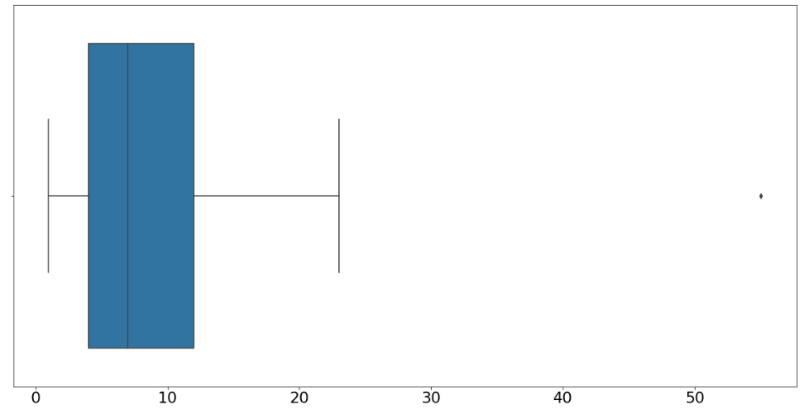

## 选择题

1.  假设检验中，第二类错误是 C

    A. 接受正确原假设
    B. 拒绝正确原假设
    C. 接受错误原假设
    D. 假设设立不正确 

2.  假设检验中，原假设和备择假设 D

    A. 都有可能成立

    B. 都可能不成立

    C. 有可能有一个成立

    D. 只可能有一个成立

3.  I类错误指的是 A

    A. 假阳性率

    B. 假阴性率

    C. 阳性似然比

    D. 阴性似然比

4.  为了描述歌唱赛中评委给一个选手的评分情况，最适合的是 B

    A. 条形图

    B. 箱线图

    C. 散点图

    D. 饼图

5.  哪个为连续分布 A

    A. 正态分布

    B. 泊松分布

    C. 几何分布

    D. 伯努利分布

## 填空题

1.  卡方列联表检验中，一个r✖c的表格，自由度为 <u>(r-1)✖(c-1)</u>

2.  样本[52, 59, 62, 65, 70, 83, 85]，均值95%的置信区间为<u>68±11.328</u>

    （t0.025(6)=2.447）

3.  平均每周发生1.19起致命事故，给定一周内，发生过3次事故的概率为<u>0.171</u>

4.  若X1 X2 ... Xn 是来自整体，服从N（μ，σ2）的一个样本，则其服从的分布及参数为<u>N（μ，σ2/n）</u>

5.  data为一个numpy.ndarray数据，则使用<u>np.std(data)</u>计算其标准差，使用<u>np.std(data, ddof=1)</u>计算样本标准差

## 解答题

1.  树的主人外出，委托邻居浇水，设如果不浇水，树死去的概率为0.8，若浇水死去的概率为0.15，邻居有0.9的可能记得浇水

    *   求主人回来树还活着的概率
    *   若主人回来树已经死去，求邻居忘记浇水的概率

    

    若A=树活着，B=邻居浇了水,则

    第一问求
    $$
    P(A)
    $$
    第二问求
    $$
    P(\overline{B}\mid\overline{A})
    $$
    由题意得
    $$
    P( \overline{A}\mid\overline{B}) = 0.8\
    $$

    $$
    P(\overline{A}\mid B)=0.15
    $$

    结合贝叶斯公式，求得
    $$
    P(A)=0.785
    $$

    $$
    P(\overline{B}\mid\overline{A})=0.372
    $$

2.  给出了下面21个数据，画出修正的箱线图

    1 2 3 3 4 4 5 6 6 7 7 9 9 10 12 12 13 15 18 23 55

    

    Min=1 25%=4 50%=7 75%=12 Max=55 

    异常值的上下限是

    75%+1.5*(75%-25%)=24

    25%-1.5*(75%-25%)=-8

    观察发现55为异常值，作图

3.  白色羊与黑色羊杂交，产生260只子代，181只为白色，79只为黑色，这个过程是否符合遗传定律的3:1 的比例?

    

    | 性状 | 实际次数 | 理论次数 | A-T  |
    | :--: | :------: | :------: | :--: |
    | 白色 |   181    |   195    | -14  |
    | 黑色 |    79    |    65    |  14  |

    H0:	过程符合3:1的理论比例

    H1:	过程不符合3:1的理论比例

    计算卡方，自由度为1，故使用Yates的矫正公式
    $$
    \chi _c^2 = \sum {\frac{{{{(\left| {A - T} \right| - 0.5)}^2}}}{T}}=3.739
    $$
    查找临界值
    $$
    \chi _{0.05}^2(1) = 3.84\
    $$
    大于计算值，故在0.05水平不能否定H0，表明实际次数与理论次数差异不显著，故可以接受H0，即这个过程符合3:1的理论比例

